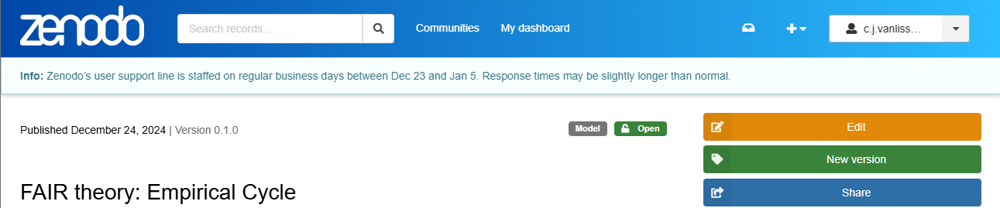

```{r, include = FALSE}
knitr::opts_chunk$set(
  collapse = TRUE,
  echo = FALSE,
  comment = "#>"
)
```


# Make FAIR Theory citable using GitHub and Zenodo

This tutorial is derived from Module 5, Task 2 of @jon_tennant_2018_1434288.

Estimated time to complete: 45-60 minutes.

<!-- fig.width=600, fig.height=861,  -->

```{r fig.align='center', out.width = "70%", fig.cap="Conceptual workflow for this task."}
knitr::include_graphics("https://github.com/OpenScienceMOOC/Module-5-Open-Research-Software-and-Open-Source/blob/master/content_development/images/Task2.png?raw=true")
```

<!-- <p align="center"> -->
<!--    -->
<!-- </p> -->


## Foreword

Although the integration of GitHub and Zenodo makes it really easier to work with these tools nowadays (January 2019), it is important to stress that there are alternatives to GitHub (Gitlab, Bitbucket, ...) and alternatives to Zenodo (Other repositories might be more suited to your community, you might ask your colleagues). For instance, one can work with Gitlab and manually upload each new versions to your university repository, getting a DOI. The principles (working with a version control system online, and archiving major versions 
in a repository which provides a persistent unique identifier) can be applied in different workflow. 

## Set up a GitHub repository

Find out how to set up a GitHub repository using the [GitHub documentation](https://github.blog/developer-skills/github/beginners-guide-to-github-repositories-how-to-create-your-first-repo/),
or by reading this paper on reproducible research workflows [@vanlissaWORCSWorkflowOpen2021].

**Important**: Here's a checklist of steps to complete:

- [ ] The repository contains a theory file
- [ ] The repository contains a LICENSE file (we recommend CC0)
- [ ] The repository contains a README file; we recommend the following sections:
    * Title, prefaced with `# FAIR theory: The Theory's Name`*
    * Description: A plain-text description of the theory and its scope
    * Interoperability: This section, also often labeled "Getting Started", "Instructions", or "How to Use" might be better labeled Interoperability from a FAIR perspective. Following the discussion in the respective section, we propose focusing on X-interoperability, and telling users exactly what they can use the theory for, and how. For example, our example is implemented in the DOT language for describing graphs, so we would provide instructions here on how to plot a DOT graph.
    * Contributing: Pertaining to the Reusability criterion, this section should tell users the *social expectations regarding reuse and contributions*.
    * License: As a complement to the preceding section, this section should refer readers to the LICENSE file to learn about the *legal constraints to reuse*.
    * Related works: This section should refer to the work that the FAIR theory is derived from, or documented in.
    * Citing this work: Tell users how to cite the theory.
- [ ] The repository settings must be set to 'public', not private, so Zenodo can discover it.

<!-- ## Choose your GitHub repository -->

<!-- Once on your GitHub project listings page at [github.com](https://github.com) head to the 'Repositories' tab. Select which repository you would like to archive, and open it up. -->

<!-- <br/> -->

## Login to Zenodo

Head over to [zenodo.org](https://zenodo.org). Zenodo is a platform where you can permanently archive your code and other project elements. Zenodo does this by assigning projects a **Digital Object Identifier** (DOI), which also helps to make the work more citable. This is different to GitHub, which acts as a place where the actual work on a project takes place, rather than long-term archiving of it. At GitHub, content can be modified, deleted, rewritten, and irreversibly changed, which makes it a bit concerning to be used for longer lasting referencing purposes. Zenodo offers more security and permanence for research outputs.

<!-- S -->

```{r fig.align='center', out.width = "70%", fig.cap="Sign up for Zenodo"}
knitr::include_graphics("https://github.com/OpenScienceMOOC/Module-5-Open-Research-Software-and-Open-Source/blob/master/content_development/images/zenodo.png?raw=true")
```

If you already have a Zenodo account, this is easy.
If not, follow the steps to create one — you can **login using your GitHub account** or ORCID profile to make things simpler, as Zenodo has a built in integration for it. This might be easier than creating yet another research account and profile.


## Authorise GitHub to connect with Zenodo

On the Zenodo website authorise it to connect to your GitHub account in the '[Using GitHub](https://zenodo.org/account/settings/github/)' section. Here, Zenodo will redirect you to GitHub to ask for permissions to use '[webhooks](https://developer.github.com/webhooks/)' on your repositories. You want to authorise Zenodo here with the permissions it needs to form those links.

```{r fig.align='center', out.width = "70%", fig.cap="Authorize Zenodo to connect with GitHub"}
knitr::include_graphics("https://github.com/OpenScienceMOOC/Module-5-Open-Research-Software-and-Open-Source/blob/master/content_development/images/zenodo_github.png?raw=true")
```


## Select the repository to archive

If you have got this far, this means that Zenodo is now authorised to configure the repository webhooks that it needs to archive the repository and issue it a DOI. To do this, on the Zenodo website navigate to the [GitHub repository listing page](https://zenodo.org/account/settings/github/) and simply "flip the switch" next to your repository.

```{r fig.align='center', out.width = "70%", fig.cap="Enable individual GitHub repositories to be archived in Zenodo"}
knitr::include_graphics("https://github.com/OpenScienceMOOC/Module-5-Open-Research-Software-and-Open-Source/blob/master/content_development/images/enabled_repos.png?raw=true")
```

## *Optional:* Check repository settings

If you were successful, you have now set up a new webhook between Zenodo and your repository. 

Optionally, you can verify this. In GitHub, click on the settings for your repository, and the Webhooks tab on the left hand side menu. This should display the new Zenodo webhook configured to Zenodo. Note, it may take a little time for the webhook listing to show up.

```{r fig.align='center', out.width = "70%", fig.cap="Check that webhooks are enabled for your GitHub repository."}
knitr::include_graphics("https://github.com/OpenScienceMOOC/Module-5-Open-Research-Software-and-Open-Source/blob/master/content_development/images/webhooks.png?raw=true")
```

## Create a new release

To archive a  repository on Zenodo, you must create a new release. This is done in the 'releases' tab on the GitHub repository front page (top center).

The first time you archive a repository is known as the 'first release'. All subsequent releases are automatically archived.

```{r fig.align='center', out.width = "70%", fig.cap="Check that the repository first release was successful."}
knitr::include_graphics("https://github.com/OpenScienceMOOC/Module-5-Open-Research-Software-and-Open-Source/blob/master/content_development/images/first_release.png?raw=true")
```

To archive your repository, click 'Create a new release' back in Zenodo. In the form, you have to choose a tag and release title.
Unless you use another convention for versioning (which should be documented in README.md),
we suggest using semantic versioning for both, starting with version `0.1.0`.
Do not use the label `v0.1.0`, as this has caused compatibility issues with Zenodo in the past.
Fill out this value in both fields (tag and title).


```{r fig.align='center', out.width = "70%", fig.cap="Create a new release."}
knitr::include_graphics("https://github.com/OpenScienceMOOC/Module-5-Open-Research-Software-and-Open-Source/blob/master/content_development/images/create_release.png?raw=true")
```

Finally, click 'publish release', and your archive will be published and versioned on GitHub.

To verify that your release was archived on Zenodo and assigned a DOI,
you need to visit the [Uploads](https://zenodo.org/deposit) tab.

```{r fig.align='center', out.width = "70%", fig.cap="Check the new release has been uploaded."}
knitr::include_graphics("https://github.com/OpenScienceMOOC/Module-5-Open-Research-Software-and-Open-Source/blob/master/content_development/images/upload_release.png?raw=true")
```

## Entering Meta-Data

By default, Zenodo assumes that GitHub repositories contain software and documents them as such.
To document our archive as a FAIR theory requires adding some extra information on Zenodo.
On Zenodo click the [Upload](https://zenodo.org/deposit) tab in the main menu, where you should find your newly uploaded repository.

```{r fig.align='center', out.width = "70%", fig.cap="Click the orange Edit button."}

```

Click the orange `Edit` button, and supply the following information:

- [ ] Resource type: Set this to `Model`
- [ ] Title: Verify that the title is prefaced with `FAIR theory:`
- [ ] Keywords and subjects: Add the keyword `fairtheory`
- [ ] Related works: List the DOIs/identifiers of related (print) works. Use the `Relation` field as appropriate. For example:
    + `Is documented by` a theory paper you wrote, in which you introduce this FAIR theory
    + `Is derived from` an existing theory, which was published in print (paper, book chapter) but not made FAIR

To save these changes, click 'Publish'.

> **Pro-tip**: Check the `Citation` field on the Zenodo page, and copy-paste it into the README file of your GitHub repo to make cross-linking even easier (or refer users to the Zenodo page to find the citation, which obviates the need to manually update this information). Click the DOI bage in the `Details` field to get instructions on how to add a clear highlighted DOI badge to your GitHub repository, for users to see and make use of your DOI:

[](https://doi.org/10.5281/zenodo.1323437)

The GitHub/Zenodo integration will assign one "mother-DOI" to the project, as well as a unique DOI to each version/release of the FAIR theory. This enables users to refer to and cite specific versions of the theory. The list of authors for the citation is automatically determined by the GitHub user account names used by the repository - this can be edited on Zenodo, as explained above. DOIs used in Zenodo are registered through the [DataCite](https://www.datacite.org/) service.


**CONGRATULATIONS!!**

Your FAIR theory is now archived in Zenodo, and with a DOI that can be versioned to reflect updates to the repository version through time. You should be able to see details of this on the GitHub Zenodo page for your repository. This also means that your archived projects can get picked up by other indexing services and search engines that use DOIs too.

Providing a long-term archive and a DOI for your work is required for others to be able to properly cite it, as this provides basic citation metadata. For Open Science, it is important to be able to comprehensively cite the resources that you use in your research, including theory, and this workflow enables that to happen, in line with best practices. Making theory FAIR also helps elevate the standard of theory to that of the standard of other research outputs, like papers and software.

> **Pro-tip**: Is your research funded by an EU grant? Now you can directly connect your FAIR theory to your grant by updating the grant section of the metadata on the project's Zenodo record. This massively helps to increase its discoverability!

## Checklist for citing your project

So now you have a sustainably archived GitHub repository in Zenodo that is ready to be re-used and cited! Before continuing, make sure that you have:

- [ ] Linked your GitHub project to Zenodo. If you see a complete copy of your GitHub repository in Zenodo then things are working.
- [ ] Zenodo and GitHub integrated setup works nicely. For example have all the author names, and correct project title come across to Zenodo. If not, or if authors just have nicknames you can edit these details in Zenodo.
- [ ] Project has a first release, with a DOI. You should have a DOI displayed on your projects Zenodo page. This first DOI is called the 'concept DOI' and is the master DOI linking to all subsequent release DOIs. Copy this DOI link and embed it in your GitHub projects README page. You're done!

### Additional resources

[Making your code citable](https://guides.github.com/activities/citable-code/) - GitHub Guides.

# References