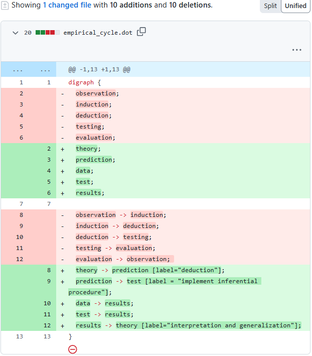

```{r setup, include = FALSE}
library("papaja")
r_refs("r-references.bib")
```

```{r analysis-preferences}
# Seed for random number generation
set.seed(42)
knitr::opts_chunk$set(cache.extra = knitr::rand_seed)
```


The FAIR Guiding Principles (hereafter: FAIR principles) were established to improve the reusability of research data by making them more Findable, Accessible, Interoperable and Reusable [@wilkinsonFAIRGuidingPrinciples2016] for both humans and computers.
Since the FAIR principles' inception, scholars have demonstrated their relevance for making other information artifacts more open, such as research software [@lamprechtFAIRPrinciplesResearch2019] and computational workflows [@wilkinson2024applying].
This paper argues that the FAIR principles can similarly advance effective and transparent scholarly communication about theory.
To this end, we introduce "FAIR theory":
a digital instantiation of a scientific theory, published as a self-contained and citable information artifact distinct from the scientific paper,
compliant with the FAIR principles.
FAIR theory has the potential to improve the efficiency of scholarly communication and
accelerate cumulative knowledge acquisition.
We focus on applications in psychology, but the principles are relevant across the social sciences and beyond.

## The Need for FAIR theory

The so-called "replication crisis" has prompted extensive reforms in psychology and other scientific fields [@lavelleWhenCrisisBecomes2021; @scheelWhyMostPsychological2022].
Concern that undisclosed flexibility in analyses was a major factor for the abundance of non-replicable findings led to widespread adoption of open science practices like preregistration and replication [@nosekPromotingOpenResearch2015a].
These various practices ensure transparent and repeated testing of hypotheses by commiting to an analysis plan in advance.
However, recent reviews show that most preregistered hypothesis tests are not supported by empirical evidence [@scheelExcessPositiveResults2021].
Thus, increased rigor in testing has revealed that the root cause of the replication crisis is more fundamental:
Psychological theories rarely provide hypotheses that are corroborated by evidence.
Furthermore, theories are often so vague that they can accommodate mutually inconsistent findings,
as the theory's central claims evade falsification.
A good example of this is found in “self-determination theory” (SDT), which emphasizes the role of intrinsic and extrinsic motivation in human behavior.
Initially, intrinsic motivation was understood as engaging in an activity purely for the inherent satisfaction it provides, free from any external rewards or pressures [@deciEffectsExternallyMediated1971].
Over time, however, SDT expanded its definition to include motivations driven by the fulfillment of basic psychological needs—autonomy, competence, and relatedness—all still categorized as "intrinsic" [@ryanSelfdeterminationTheoryFacilitation2000].
The profound difference between these definitions becomes clear when considering the act of changing a child’s dirty diaper.
Under the original definition, few caregivers would be considered intrinsically motivated, after all, it’s not exactly a joy-filled experience.
Yet, under the expanded definition, many would be, as the act may fulfill deeper needs, such as the desire to nurture and care for one’s child.

<!-- CJ: Maybe we should give an example here. Does anyone know one? -->
<!-- NvD: Harris 1976 has a nice example about how cognitive dissonance theory can be formalized in multiple ways, which offer hypotheses that contradict each other -->

Scholars have been raising concerns about the state of theory in psychology for nearly 50 years [@robinaughInvisibleHandsFine2021; @meehlTheoreticalRisksTabular1978].
One main concern is that theories lack *formalization* [@szollosiArrestedTheoryDevelopment2021].
<!-- I still believe formalization != precision. Theories can be 100% formal and still 0% precise. -->
<!-- NvD: We should add somewhere what we mean by "formalization." In philosophy of science, formal logic about syntax (the propositions and predicates can have any meaning). However, what we mean, I think, is the explication of a narrative in (something so detailed and explicit that it can be captured with little error in) analytical or computational form (but the meaning remains. E, M, and C stand form something is E = MC<sup>2</sup>).   -->
When theories are difficult to understand on their own,
without either substantial interpretation or additional background knowledge,
it becomes difficult do derive precise predictions,
and therefore hard to falsify the theory. 
A second concern is the lack of transparent and participative scholarly communication about psychological theory, which limits its progression and development.

Given these concerns, it is an imbalance that scientific reform initiated by the open science movement has focused primarily on improving deductive methods.
The equally critical inductive processes of theory construction and improvement have been largely overlooked^[We use induction to describe inferences from specific observations to general theories. Others have used the term "abduction", coined by Peirce to describe "inference to the best explanation". However, Peirce later acknowledged that abduction "is not essentially different from induction" [@peirceCollectedPapersCharles1960, p.4881]. As defining what makes a theory "best" requires auxiliary assumptions, we consider abduction to be a special case of induction. For present purposes, however, the terms are interchangeable.].

<!-- NvD: I cannot accept this footnote as an adequate characterization. Abduction is not just "inference to the best explanation." It is typically used as inference to a plausible explanation (but there could be more). See for instance Brian Haig's 2005 paper. Also, I don't see why it matters either way "why defining what makes a theory "best" requires auxiliary assumptions". At the very least I would like to change "we consider abduction to be a special case of induction", because I disagree. I am fine with the last sentence though ;-) My suggestion is to write the following: -->

<!-- NvD: We use induction to describe inferences from specific observations to general theories. In philosophy of science the term "abduction" is often used for the inference from observations to plausible explanations. We note that induction and abduction come in several varieties in philosophy science, which overlap in several respects For present purposes, however, the terms are interchangeable. -->

<!-- Peirce: CP 8.233 Cross-Ref:†† -->
<!-- 233. This is not essentially different from induction. Only it is most -->
<!-- usually an induction from instances which are not discrete and numerable. I now -->
<!-- call it Qualitative Induction. It is this which I used to confound with the second -->
<!-- line of procedure, or at least not to distinguish it sharply. -->
The present paper restores balance by applying, for the first time,
open science principles to psychological theory.
We apply the FAIR principles to scientific theories,
introducing *FAIR theory* to 
facilitate transparent scholarly communication and accelerate cumulative knowledge acquisition.

## Theory and Scientific Progress

According to the *empirical cycle* [@degrootMethodologieGrondslagenVan1961],
a meta-theoretical model of cumulative knowledge acquisition,
research ideally follows a cyclical process with two phases, see Figure \@ref(fig:figecs), panel (a).
In the deductive phase, hypotheses derived from theory are tested on data. In the inductive phase, patterns observed in data are generalized to theoretical principles.
In this model, theories are the vehicle of scientists' understanding of phenomena.
Ideally, they are iteratively updated based on deductive testing and inductive theory construction.


```{r include = FALSE}
library(DiagrammeR)
library(DiagrammeRsvg)
library(rsvg)
ec_groot <- grViz(diagram = 
'digraph neato { node [fontsize = 6]; 
    edge [fontsize = 6];
    overlap = false; fontsize = 7;
  graph [layout = neato]
  
  observation [pos = "2,3!"];
  induction [pos = "3,2!"];
  deduction [pos = "3,1!"];
  test [pos = "1,1!"];
  evaluation [pos = "1,2!"];
  
  observation -> induction;
  induction -> deduction;
  deduction -> test;
  test -> evaluation;
  evaluation -> observation;
  
}')
ec_wagenmakers <- grViz(diagram = 
'digraph neato { node [fontsize = 6]; 
    edge [fontsize = 6];
    overlap = false; fontsize = 7;
  graph [layout = neato]
  
  subgraph cluster_discovery {
    label="Discovery";
    induction [label="New hypothesis" pos = "3,2!"];
    deduction [label="New prediction" pos = "3,1!"];
  }
  observation  [label="Old knowledge and old data" pos = "2,3!"];
  subgraph cluster_justification {
    label="Justification";
    test [label="Test on new data" pos = "1,1!"];
    evaluation [pos = "1,2!"];
  }

  observation -> induction [label="Speculate & explore" labeljust=r];
  induction -> deduction  [label="Deduce"];
  deduction -> test  [label="Design new experiment"];
  test -> evaluation  [label="Statistical analysis"];
  evaluation -> observation  [label="Knowledge accumulation"];

}')
ec_lissa <- grViz(diagram = 
'digraph neato { node [fontsize = 6]; 
    edge [fontsize = 6];
    overlap = false; fontsize = 7;
  graph [layout = neato]

  theory [pos = "2,3!"];
  prediction [pos = "3,2!"];
  data [pos = "1,1!"];
  test [pos = "2,1!"];
  results [pos = "1,2!"];
  
  theory -> prediction [label="deduction"];
  prediction -> test [label = "implement inferential procedure"];
  data -> results;
  test -> results [label = "evaluate reproducible code"];
  results -> theory [label="interpretation and generalization"];

}')
rsvg_svg(charToRaw(export_svg(ec_groot)), "ec_groot.svg")
rsvg_svg(charToRaw(export_svg(ec_wagenmakers)), "ec_wagenmakers.svg")
rsvg_svg(charToRaw(export_svg(ec_lissa)), "ec_lissa.svg")
rsvg_pdf(charToRaw(export_svg(ec_groot)), "ec_groot.pdf")
rsvg_pdf(charToRaw(export_svg(ec_wagenmakers)), "ec_wagenmakers.pdf")
rsvg_pdf(charToRaw(export_svg(ec_lissa)), "ec_lissa.pdf")

rsvg_png(charToRaw(export_svg(ec_groot)), "ec_groot.png")
rsvg_png(charToRaw(export_svg(ec_wagenmakers)), "ec_wagenmakers.png")
rsvg_png(charToRaw(export_svg(ec_lissa)), "ec_lissa.png")
```

```{r, eval = FALSE, out.width = "32%", fig.cap='Three implementations of the "empirical cycle".', fig.subcap=c('De Groot, 1969', 'Wagenmakers et al., 2018', 'Van Lissa, 2025')}
knitr::include_graphics("ec_groot.pdf")
knitr::include_graphics("ec_wagenmakers.pdf")
knitr::include_graphics("ec_lissa.pdf")
```

```{r figecs, eval = TRUE, fig.cap='Three implementations of the "empirical cycle" [@degrootMethodologieGrondslagenVan1961].'}
# rsvg::rsvg_pdf("empirical_cycle1.svg", "ec_visio.pdf")
knitr::include_graphics("ec_visio.pdf")
```


```{r}
library(tidySEM)
library(ggplot2)
y_spacing <- .5
lo <- get_layout("", "A", "",
                 "D", "", "B",
                 "", "C", "", rows = 3)

edg <- data.frame(from = c("A", "B", "C", "D"),
                  to = c("B", "C", "D", "A")
)

p <- prepare_graph(layout = lo, edges = edg)
p$edges[] <- lapply(p$edges, unlist)
p$edges$connect_from <- list("right", "bottom", "left", "top")
p$edges$connect_to <- list("top", "right", "bottom", "left")
p$edges$curvature <- c(rep(60, 4))
p$edges$label <- c("deduction", "testing", "induction", "generalization")
p$edges$label_colour <- "gray50"
p$edges$colour <- "gray50"

p$nodes$label <- c("Theory", "Hypothesis", "Data", "Observed\npatterns")

p_old <- p
g <- plot(p)

topofplot <- max(p$nodes$node_ymax)

headers <- data.frame(
  x = c(3, 5),
  y = topofplot + 2*y_spacing,
  lab = c("Inductive phase", "Deductive phase")
)

letters <- p$nodes[, c("name", "x", "y")]
letters$y <- letters$y+.26
letters$x <- letters$x+.5
g <- g + geom_hline(yintercept = topofplot+y_spacing) +
  geom_vline(xintercept = median(p$nodes$x), linetype = 5) +
  geom_text(data = headers, aes(x = x, y = y, label = lab), vjust = 1) +
  #geom_label(data = letters, aes(x = x, y = y, label = name), fill = "lightblue") +
  scale_x_continuous(expand = c(0,0))+
  scale_y_continuous(expand = c(0,0))
g$layers <- g$layers[c(9, 1:8, 10:length(g$layers))]
ggsave("empirical_cycle.pdf", g, device = "pdf", width = 200, height = 200, units = "mm")
```

```{r figec, eval = FALSE, fig.cap="A take on the empirical cycle by De Groot"}
knitr::include_graphics("empirical_cycle.pdf")
```

In a progressive research program [@lakatosHistoryScienceIts1971],
this cycle is regularly completed to iteratively advance our understanding of the studied phenomena.
<!-- NvD: This is not exactly what Lakatos said. Also, I don't think many psychologists are familiar with his work. We do not need to reference his perspective. -->
<!-- by successively increasing the empirical content of a theory. -->
<!-- In psychology, this is typically achieved by either generalizing to a larger set of people, contexts, situations, or environments. <!--AB would you agree?-->
<!-- CJ: I am not sure if I agree; I think increasing the empirical content rather implies more and more precision, which loses generality but gains specificity. Not sure how to resolve.
This needs more work! -->
<!-- NvD: SOmething like? "In the envisioned ideal, the empirical cycle is a virtuous spiral where theories become increasingly more precise and/or universal (i.e., Popper's empirical content), offering hypotheses that can be more easily falsified / severely tested, data become more informative / less ambiguous about the patterns in nature, which in turn inform even more precise and/or universal theories. -->
There are, however, indications that contemporary psychology falls short of this ideal.
Firstly, because hypothesis-testing research is over-represented in the literature: 
According to @kuhbergerPublicationBiasPsychology2014, 89.6% of papers published in psychology report confirmatory hypothesis tests.
Closer examination of deductive research reveals, however, that the link between theory and hypothesis is often tenuous or absent [@scheelWhyHypothesisTesters2021; @oberauerAddressingTheoryCrisis2019].
Only 15% of deductive studies referenced any theory, and theory was often not cited in relation to the hypothesis [@mcphetresDecadeTheoryReflected2021].
The remaining 85% of deductive studies lacked an explicit connection between theory and hypothesis.
Perhaps some of these ungrounded hypotheses are rooted in implicit theories privy only to the author,
in which case it would be straightforward and important to make these explicit [@friedTheoriesModelsWhat2020; @norouziCapturingCausalClaims2024].
Or, perhaps some hypotheses are thoughtlessly reported as part of entrenched research practices [@gigerenzerNullRitualWhat2004],
but are not of substantive interest, such as null hypotheses that exist solely for the purpose of being rejected [@vanlissaTeacherCornerEvaluating2020].
Testing ad-hoc hypotheses not grounded in theory does not advance our principled understanding of psychological phenomena.
<!-- NvD: I don't think that statement completely covers it. How about: "Testing ad-hoc hypotheses not grounded in theory might inform us of the psychological phenomena that we can consistently observe (e.g., cognitive biases, attentional blindess, comorbidity of depression and anxiety disorder, etc.). However, it does not advance our understanding of the processes and mechanisms that bring about these phenomena. -->
Put differently: collecting significance statements about ad-hoc hypotheses is much like trying to write novels by collecting sentences from randomly generated letter strings [@vanrooijTheoryTestHow2021].

Theory thus has an uncomfortable and paradoxical role in contemporary psychology:
The majority of papers ostensibly test hypotheses,
but these are rarely connected to, let alone derived from, theory.
Moreover, test results do not routinely contribute to the improvement or rejection of theories.
The paradoxical role of theory in psychology is perhaps best described by Meehl's observation that theories in psychology "lack the cumulative character of scientific knowledge. They tend neither to be refuted nor corroborated, but instead merely fade away as people lose interest" [@meehlTheoreticalRisksTabular1978].

## Making Theory FAIR

The present paper introduces open science methods for theory specification and archival.
Merely publishing theory in a research article does not make it open;
to be open, theory should adhere to established open science standards.
We do so by implementing theories as information artifacts,
archived with appropriate metadata in a FAIR-compliant repository (e.g., Zenodo).
Metadata are "data about the data", they provide information about the nature and content of an information artifact.
Metadata are stored in the repository where the version of record of the FAIR theory is deposited.
FAIR theories are *Findable* via a DOI or by searching the repository they are archived in;
*Accessible* in a machine- and human-readable filetype;
*Interoperable* for specific purposes, for example, within the data analysis environment;
and *Reusable* in the practical and legal sense, so that they may be iteratively improved by the author or by others.
<!-- AB I think some initial word on what is covered is needed here; otherwise readers may wonder what we mean to cover--> 
<!-- CJ: Since this is in the next paragraph, I think it's redundant. Will merge there -->
Following the original proposal of Lamprecht and colleagues,
we adapt the FAIR principles for theory, see [Supplemental Table S1](https://github.com/cjvanlissa/fair_theory/blob/main/fair_principles.csv).
We reflect on the necessary changes (which are minor),
as well as on the current state and future of FAIR theory in psychology.
The resulting principles provide guidance for instantiating theory as a FAIR information artifact,
and we provide worked examples to encourage their adoption.

```{r tabfair, eval = FALSE}
tab_fair <- read.csv("fair_principles.csv", stringsAsFactors = FALSE)[, c("Criterion", "Original", "Theory", "Our.action")]
names(tab_fair) <- c("Criterion", "Original", "Theory", "Action")
papaja::apa_table(tab_fair, landscape = TRUE, align = "m{.1\\linewidth}m{.35\\linewidth}m{.35\\linewidth}m{.15\\linewidth}")
```


## What is Theory?


<!-- We don't explicitly define theory, but discuss the most important ideas of what theory might be, and advocate for a pluralism of information that can be tracked as FAIR theory (e.g. also such things as scientific practice (experimental design, materials)). -->
<!-- The nature of the tracked information can change over time, as a scientific theory matures. -->
<!-- The discussion about the distinction between FAIR theories and models is removed, as I believe it might be confusing for first-time readers and not really necessary for the bigger picture of the paper (but of course could be re-added). -->
<!-- NvD: I wonder if we need what is stated about the syntactic, semantic, and pragmatic perspectives. We can leave it at the characterization that theories are (typically) concerned with the explanation and understanding of what can be observed (directly or indirectly) tested (in the laboratory or natural experiments) and manipulated. But, this can come in many forms and we do not exclude the possibility that there are acceptions to this characterization that we could still consider a scientific theory. We can then state that we use Meehl's view for convenience in this paper, but that it is compatible other perspectives (or something.  -->
Definitions of theory are abundant, and are the subject of extensive scholarly debate.
Given that a pluriformity of definitions are consistent with FAIR theory principles,
our suggested approach is not limited to any one particular definition.
Perspectives on scientific theory have been categorized as syntactic, semantic, and pragmatic [@scientifictheories].
The syntactic view describes theories as "sets of sentences in a given logical domain language" [@scientifictheories, ch. 2],
acknowledging that each domain (a scientific field, such as psychology or physics) has its own theoretical vocabulary.
We recognize the syntactic view in Meehl's [-@meehlAppraisingAmendingTheories1990] hierarchy of ever-more specific "statements" a theory might contain:
statements about the types of entities postulated (i.e., ontology),
statements about causal connections between those entities,
statements about the functional form of those connections,
and statements about their specific numerical values [cf. @frankenhuisStrategicAmbiguitySocial2023; @guestWhatMakesGood2024].
The semantic view challenges the necessity of distinct domain languages for different scientific fields, and instead advocates for formalizing theories using mathematics.
It shifts the focus from theories as collections of sentences to mathematical models.
The term "model" is not uniquely defined within the literature;
it has been described as a "specific instantiation of theory narrower in scope and often more concrete, commonly applied to a particular aspect of a given theory" [@friedTheoriesModelsWhat2020].
This implies that theories and models are not fundamentally distinct, but rather, that for each model, there is a more general theory that subsumes it (one person's model is another person's theory).
<!-- Paradigms at the broadest level encompass the larger narrative, frameworks gather and organize concepts and terms, but only theories have a degree of specificity that allows us to derive specific testable and falsifiable hypotheses or models with exact mathematical relations between concepts (cf. Partelow, 2023, Table 1, https://link.springer.com/article/10.1007/s13412-023-00833-w#). -->
The pragmatic view holds that there might not be one structure or definition of scientific theories, but instead, definitions differ across scientific domains.
It also argues that nonformal aspects (e.g. commonly used analogies) and practices (e.g. experimental designs) can be an important part of scientific theories.

It is best left to the scholarly community to decide which parts of theory, models, or other aspects should be represented as FAIR theory. 
As the practice of FAIRification becomes more embedded,
we expect that it will become increasingly clear what kind and form of information is useful.
As a particular FAIR theory evolves, details may be added, and the nature of the information tracked might even change.
For example, following Meehl, we could envision a theory that starts out with establishing, through observation, an ontology of constructs relevant for a given phenomenon.
After initial exploratory research, the theory might be further specified by making assumptions about how these constructs are causally connected.
Over time, more precise *statistical/mathematical models* could be derived by further assuming a specific functional form for relationships (e.g., linear effects) and error families for the distribution of measured variables (e.g., normal distributions).
This allows for the specification of statistical models, which make just enough assumptions to allow the estimation of the remaining unknown parameters (e.g., regression slopes) from data.
Going even further, a *generative/computational model* could be specified,
which is completely parameterized (i.e., specific values of regression slopes are also assumed) such that an interpreter (e.g., the R programming language) can use the model to generate new data.
Also, aspects of scientific practice might be added over time - either to the theory itself, or as references recorded in the theory metadata.
Examples include experimental designs (e.g., longitudinal designs observing change over time), measurement tools (e.g., different questionnaires used to assess the same construct), or study subjects (e.g., specific strains of rats).

As an applied example, consider a comprehensive theory of disease spread and pandemics which covers various psychological factors
such as adherence to infection prevention protocols (e.g., social distancing),
pandemic-related behavior (e.g., panic buying),
and pandemic-related distress
[@taylor2022psychology].
The theory may encompass a particular transmission _model_ for disease spread including precise parameters for the process of infection (e.g., social distance, average duration of encounters, ventilation) and incubation times.

### The Role of Theory Formalization

Concerns about the state of theory in the psychological literature revolve around two issues: theory formalization and theory (re-)use. 
<!-- NvD: Maybe we should add "specification" as part of "formalization" or "formalisation" as a part of "specification", because not everybody that is advocating better theories thinks that we should focus on formalization.  -->
More rigorous formalization increases theories' *empirical content* [@popperLogicScientificDiscovery2002] because it expresses ideas as precise statements, clearly demarcating what should (not) be observed if the theory were true.
For example, Baddeley's verbal description of the phonological loop in his theory of working memory stands out for its particular clarity and comprehensibility, yet it allows for at least 144 different implementations depending on the specification of various parameters such as decay rate, recall success, or rehearsal sequence, which were left undefined in the original theory [@lewandowsky2010computational].
Without committing to specific implementations a-priori,
the theory becomes hard to test.
Compared to theories expressed in natural language,
formal theories facilitate inconsistency checking and evaluation of a theory's (lack of) ambiguity.
Committing to specific implementations of the different components, their causal connections, and the functional forms of these relationships makes the theory more precise.
More precise theories are easier to falsify,
which necessitates specific revisions and advances our principled understanding of the phenomena they describe.

FAIR theory imposes no restrictions on the manner in which theories are derived and implemented;
rather, it increases the fidelity and ease with which they are communicated.
Thus, FAIR theory does not require theories to be formal.
At the same time, formal theories are not automatically FAIR.
The FAIR principles pertain to theories' metadata documentation and sharing in digital archives, with the aim of enhancing their reusability and extensibility.
They can be applied to theories representated in natural language,
as well as formal theories represented using mathematical notation, algorithmic pseudo code, or a set of logical clauses.
Thus, for example, "grounded theory", derived from qualitative research,
can be represented as a FAIR theory if it is represented as plain-text propositions and archived in a FAIR repository with appropriate metadata.
Conversely, a formal theory is not FAIR if it is confined to a journal article without any key words to identify it as a theory paper (lacking Findability), represented merely as a bitmap image (limiting Accessibility and Interoperability), or behind a paywall (limiting Reusability).
FAIR theory is thus consistent with, but does not require, formalization (also see the section on *Accessibility* below).

### Modular Publishing

We propose FAIR theory as an instantiation of modular publishing [@kirczModularityNextForm1998].
In most fields, the primary unit of scientific communication is the academic paper.
A paper may depend on multiple resources - materials, data, code, and theory - but these are often merely described in the text.
Modular publishing is the practice of making each of these resources available as independent citable *information artifacts* in their own right,
with adequate metadata that is indexed in standardized repositories [@vandesompelRethinkingScholarlyCommunication2004].
Data sharing is a good example of a modular publishing practice that is widely adopted and increasingly required by funding agencies, journals, and universities.
Scholars can archive information artifacts in repositories like [Zenodo](https://zenodo.org/),
which was developed by [CERN](https://home.cern/) under the European Union's [OpenAIRE](https://www.openaire.eu/) program [@zenodo].
To maintain a persistent record of scholarly communication,
Zenodo mints DOIs for information artifacts - as does, for example, the [Crossref](https://www.crossref.org/) association,
which is used by many academic publishers.
Finally, the DataCite Metadata Schema offers a standard way to document the nature of relationships between information artifacts [@datacitemetadataworkinggroupDataCiteMetadataSchema2024].
<!-- Platforms like the [Open Science Framework](https://osf.io/) connect these various research infrastructures to offer a more user-friendly front end for open science-related workflows. -->
For example, a dataset collected for a specific paper would be archived in Zenodo with the metadata property `resourceType: dataset`,
and cross-reference the published paper with `relationType: IsSupplementTo`.
Similarly, a FAIR theory object can be connected to a specific paper which might serve as the theory's documentation and canonical reference by using `relationType: IsDescribedBy`, while the reverse relationship, documented in the canonical reference paper, is `relationType: Describes`. Other types are useful for making relationships between multiple theory objects explicit: If an existing theory is made FAIR without substantial alterations,
the resulting FAIR theory metadata would cross-reference the existing theory as `relationType: IsDerivedFrom`.
If an existing theory is updated, `relationType:IsNewVersionOf` could be used to reference previous versions.
If a variation of an existing FAIR theory is created, cross-reference it with `relationType: IsVariantFormOf`.
<!-- FS: I still think we should have a dedicated term for a digital FAIR theory object -->

### Version Control

We can take inspiration from the field of computer science for well-established processes for iteratively improving information artifacts.
Version control systems, like Git, have long been used to iteratively improve computer code, while managing parallel contributions from collaborators and allowing for experimentation and diverging development without losing information.
Git tracks line-by-line changes to text-based files,
and maintains a complete history of those changes.
It has long been argued that Git is particularly well-suited to academic work [@ramGitCanFacilitate2013].
Git can be used, for example, to facilitate reproducible research, manage distributed collaboration, and improve preregistration [@vanlissaWORCSWorkflowOpen2021; @peikertReproducibleResearchTutorial2021].
Git provides a useful framework for developing FAIR theory,
because it enables explicitly comparing versions of a file (or: theory),
incorporating changes by different authors,
and branching off into different directions (e.g., competing hypotheses) while retaining an explicit link to the common ancestor.
This makes it possible for meta-scientists to study the provenance of a theory and determine how well different versions of a theory explain empirical evidence [@vanlissaUsingEndpointsCheck2023].
Note, however, that the function of Git(Hub) is *not* to archive a FAIR theory.
FAIR-compliant repositories like Zenodo serve the specific purpose of archival.
Thus, while theory development may take place on GitHub, the version of record should be archived in Zenodo, with appropriate metadata.

### Semantic Versioning

Aside from technical solutions, version control is a social process as well.
On the one hand, regular updates can improve theories - but on the other hand, it risks breaking compatibility between theories and hypotheses derived from them, or compatibility between one theory and others that depend upon it.
For example, if we construct a theory to explain a specific phenomenon, and we cross-reference an existing theory comprising an ontology for our field - that dependency is broken if the ontology is later updated and our phenomenon of interest is removed.
<!-- NvD: Maybe we can add an  example (e.g., the theory that explains ego-depletion and the failed replication of the phenomenon). -->
In computer science, these challenges are navigated by assigning version numbers.
Specifically, *semantic versioning* comprises a simple set of rules for assigning version numbers to information artifacts.
Whereas version control tracks changes,
semantic versioning communicates what those changes mean to users of the theory,
guides the social process of theory development, and signals how much a theory has been changed.
We propose the following adaptation of semantic versioning for theories:

Given a version number in the format MAJOR.MINOR.PATCH (where MAJOR, MINOR, and PATCH are placeholders for positive integer numbers including zero), increment the:

- MAJOR version when you commit backwards incompatible changes, i.e., the
      theory now contains empirical statements that are at odds with
      a previous version of the theory
- MINOR version when you expand the set of empirical statements in a
      backward compatible manner (i.e., the previous version is
      subsumed within the new version)
- PATCH version when you make backward compatible bug fixes, cosmetic
      changes, fix spelling errors, or add clarifications

# The FAIR Principles

## Findability

Making theories Findable would allow researchers to easily identify relevant theories
and ground their hypotheses in established theoretical foundations.
It further increases the impact and reuse potential of theories across disciplines,
either through direct application (where one discipline stumbles upon a problem that is already well-understood in another discipline),
or through analogical modeling.
In analogical modeling, the structure of a theory from one discipline is applied to a phenomenon in another field.
For example, predator-prey models have inspired theories of intelligence [@vandermaasDynamicalModelGeneral2006], and the Eysenck model of atomic magnetism has inspired a network theory of depression [@cramerMajorDepressionComplex2016].
Findability also enables meta-research on theories, 
in the same way libraries and search engines have enabled scholars to study the literature via systematic reviews.
In a similar way, it would become much easier to explicitly compare different theories of a specific phenomenon,
or to study structural properties of theories.

The four Findability criteria are applicable to theory with only minor adjustments, see [Supplemental Table S1](https://github.com/cjvanlissa/fair_theory/blob/main/fair_principles.csv).
First, this requires assigning a globally unique and persistent identifier, such as a DOI, to each theory (F1).
Of the many services that provide DOIs for scientific information artifacts,
Zenodo and the Open Science Framework are commonly used in psychology.
Second, Findable theory is described with rich metadata	(F2).
This includes citation metadata (e.g., referencing a scientific paper that documents the theory, or a psychometric paper that operationalizes specific constructs).
It might further include domain-specific metadata, such as a reference to a taxonomy of psychological constructs [@boscoMetaBUSVehicleFacilitating2017],
ontology [@guyonMeasurementOntologyEpistemology2018],
or catalog of psychological phenomena.
Metadata should also include identifiers for all the versions of the theory it describes	(F3);
Zenodo handles this by default by providing an overarching DOI for an information artifact which subsumes the DOIs of that artifact's versions.

Finally, metadata should be registered or indexed in a searchable registry (F4).
It is important to note that, while many archives are technically searchable (e.g., GitHub, FigShare, the Open Science Framework, institutional repositories),
only few are specifically designed for FAIR-compliant archival.
Zenodo stands out in this respect.
Thus, while using Git for version control and GitHub for collaboration has specific advantages for scientific work [@ramGitCanFacilitate2013],
the version of record should be archived in a FAIR repository like Zenodo.
Using standardized metadata further improves the Findability of theories archived within FAIR repositories.
The DataCite Metadata Schema provides a controlled vocabulary for research output, and the `resource_type: model` matches the description of FAIR theory [@datacitemetadataworkinggroupDataCiteMetadataSchema2024].
<!-- > An abstract, conceptual, graphical, mathematical or visualization model that represents empirical objects, phenomena, or physical processes. -->
Furthermore, we suggest using the keyword `"fairtheory"` for all resources that constitute or reference (a specific) FAIR theory.
<!-- (separating the words `FAIR` and `theory` by a space or hyphen would lead them to be interpreted as separate tokens in many search engines). -->

Findability is substantially amplified if intended users of a resource know where to search for it.
This is a known problem in relation to research data and software [@katzSpecialIssueSoftware2024].
Regrettably, most academic search engines only index traditional print publications, not other information artifacts.
Since the status quo is to publish theories in papers,
the FAIR requirements are met if scholars continue to do so,
and additionally publish theories as separate information artifacts.
The `"fairtheory"` keyword can also be used to signal the presence of theory within a paper.
<!-- An ad-hoc solution is to publish a paper as documentation for the information artifact [@mcgillivrayDeepImpactStudy2022]. -->
<!-- There is even a journal - the [Journal of Open Source Software](https://joss.theoj.org/) - that publishes software documentation as a paper so that it will be indexed by search engines. -->
<!-- The same solution could be applied to theories. -->
In the longer term, it may not be necessary to write a paper for each theory.
If Zenodo becomes more recognized as a centralized repository for information artifacts, researchers may begin to search there more regularly.
Conversely, as organizations begin to recognize the value in tracking academic output other than papers, repositories may begin to index information artifacts stored in Zenodo.

There have been notable efforts to improve theories' Findability through post-hoc curation.
For example, Gray and colleagues introduced a format for representing theories,
and post many examples on their website [@grayHowMapTheory2017].
Similarly, Van Dongen and colleagues are working on a database of models and formalized theories.
<!-- Is there something to reference? Website/preprint? Otherwise is seems a bit weird to just mention this without any further information. -->
Post-hoc curation is a notable effort but does not address the root cause of the lack of Findability.
Ideally, Findability would be addressed ante-hoc, through documentation with rich metadata and modular publishing.
Both approaches can be complementary, however.
For example, post-hoc curation could make use of existing FAIR-compliant archival infrastructure like Zenodo.
Conversely, the database engineering adage "Lots of Copies Keeps Stuff Safe" (LOCKSS) implies that it is fine to archive theories in multiple places,
although it is advisable to make use of automatic integration (as exists between GitHub, Zenodo, and OSF) to avoid the need to maintain information in multiple places, which increases the risk of inconsistencies arising.

## Accessibility

Transparent scholarly communication about theory requires that theories are Accessible to all researchers and other stakeholders.
If theories are not Accessible, researchers cannot reuse and refine them. <!-- NvD: the original was logically unsound. Accessibility is necessary for reuse, but not sufficient, right?) --> 
Thus, Accessibility can accelerate cumulative knowledge acquisition.
Making theories Accessible also allows stakeholders (e.g., practitioners, policymakers, advocates) to inform themselves of the current scientific understanding of specific phenomena.
While isolated empirical findings can appear fragmented and contradictory [@dumas-malletPoorReplicationValidity2017],
theories offer a top-down, big-picture representation of the phenomena studied in a field.
In other words, theories are an important instrument in science communication.

The Accessibility principles are sometimes misunderstood as pertaining to *maximizing* access; rather, they should be understood as *regulating* it.
They apply to theory with minor changes.
Firstly, theory and its associated metadata should be Accessible by their identifier using a standardized communications protocol (A1).
This can be achieved, for example, by hosting theory in a version-controlled remote repository (such as Git), and archiving that repository on Zenodo for long-term storage.
The resulting resource will then have an identifier (DOI) which allows the theory to be accessed using a standardized communications protocol (download via `https` or `git`).
Secondly (A2), theory metadata should be Accessible, even when the theory is no longer available,
which is also achieved via long-term storage (e.g., on Zenodo).
Git remote repositories allow for access control,
and Zenodo allows for access control of individual files/resources.
<!-- An unavailable theory typically refers to a theory that was abandoned in favor of a better or more general theory (such as the phlogiston theory, which was superseded by the oxygen theory). -->
In general, it makes sense to retain outdated theories, in order to be able to track the genesis of theories over time, yet, we require the availability of meta data as a minimum requirement.

At present, there are several impediments to theories' Accessibility.
To the extent that theories are still contained within papers,
paywalls erected by publishers constitute a barrier.
Open Access publishing increases the Accessibility of all academic output, including theory.
A second impediment is more indirect:
While open access publishing increases practical access to theories,
Accessibility also requires clear and explicit communication.
<!-- NvD: I am not sure if we need to go into this much detail as presented in the rest of this Section. My suggestion is to remove most of it. I'll indicate which elements I suggest keeping -->
This property of good theories has been dubbed "discursive survival [...], the ability to be understood" [@guestWhatMakesGood2024]. 
At present, psychological theories are often ambiguous, rendering them difficult to understand [@frankenhuisStrategicAmbiguitySocial2023].
It is important to acknowledge the *indeterminacy of translation*^[Every communicative utterance (e.g., a statement in natural language, a mathematical formula, et cetera)
has multiple alternative translations, with no objective means of choosing the correct one.],
which implies that it is not possible to remove all ambiguity when communicating an idea [@quineReasonsIndeterminacyTranslation1970].
This places a theoretical upper bound on theories' ability to be understood.

Successful communication requires shared background knowledge between sender and receiver [@vogtFAIR20Extending2024].
The notion of "normal science" describes a phase in which a scientific community operates within the context of a shared paradigm,
creating the background knowledge needed for mutual understanding and productive scientific work [@kuhnStructureScientificRevolutions2009].
In real life, paradigms are rarely clear-cut, and shared background knowledge can come from different sources,
including education, cultures of communication, and availability of particular instruments for observation, measurement, and analysis - or it can be problematically absent.

A third impediment arises when theories have, what we call, a "dependency on the author" (DOA). <!-- AB citation needed?! Who came up with this term? -->
DOA occurs when a theory cannot be understood by independent scholars,
requiring the original author to provide interpretation and clarification.
<!-- We have heard DOA referred to apocryphally as the "ask Leon" phenomenon, -->
<!-- as graduate students were supposedly told to ask Leon Festinger to explain to them how their misconstrual of cognitive dissonance theory had caused their experiments to yield null results. -->
DOA relates to the discourse on "Great Man Theorizing" [@guestWhatMakesGood2024] because it enables gatekeeping: an author could insist that work requires their involvement or denounce work conducted outside their purview as illegitimate,
which violates checks and balances of scientific research.
DOA also renders theories immune to refutation,
because the author can claim that the theory was misconstrued when confronted with falsifying evidence, thus making it a moving target  [@szollosiArrestedTheoryDevelopment2021].
DOA is inherently problematic, as illustrated by cases where third parties identify logical inconsistencies within a theory [e.g., @kissnerIDENTIFICATIONLOGICALINCONSISTENCY2008].
This example demonstrates that original authors are not the ultimate authority on their theories.
DOA thus unduly impedes scientific progress, and authors should make good-faith efforts to make theories as Accessible as possible, in terms of both availability and interoperability.
<!-- NvD: Above we mention that "The Accessibility principles are sometimes misunderstood as pertaining to *maximizing* access; rather, they should be understood as *regulating* it." This feels a bit at odds. I suspect that we are not talking about the same thing here, this could be interpreted as a contradiction.  -->

In sum, while it is impossible to communicate a theory completely unambiguously,
scholars should strive to reduce unnecessary ambiguity to the greatest possible extent.
<!-- Accessibility requires theoreticians to explicit as possible about assumptions and ontological definitions to eliminate unnecessary ambiguity. -->
<!-- At the same time, it is important to recognize that there is an upper bound on interpretability, which means that it is impossible to eliminate all ambiguity. -->
It may benefit scientific discourse to normalize explicit ambiguity (these are things we don't know yet) and anticipate misunderstanding,
to invite others to fill in the blanks and motivate ever further explication of theory.
A theory's Accessibility is increased by
reducing dependencies on (implicit) background knowledge,
explication of assumptions,
formalization,
and explicit cross-references to relevant resources such as papers, ontologies, macro-theories, measurement instruments, experimental designs [@langeChecklistIncentivizingFacilitating2025a].

<!-- NvD: we use the term 'macro-theory' here for the first time. What does it mean? Do we need it? -->
<!-- The data usually need to be integrated with other data. In addition, the data need to Interoperate with applications or workflows for analysis, storage, and processing. -->

## Interoperability

Interoperability pertains to the property of information artifacts to "integrate or work together [...] with minimal effort" [@wilkinsonFAIRGuidingPrinciples2016a].
Firstly, theory and its associated metadata should use a formal, accessible, shared and broadly applicable language to facilitate (human- and) machine readability and reuse (I1).
The common practice of instantiating theory as lengthy prose or schematic drawing falls short of this ideal.
Instead, FAIR theory should, ad minimum,
be instantiated in a human- and machine-readable datatype,
as should all information artifacts created while performing scholarly work [@vanlissaWORCSWorkflowOpen2021].
Depending on the level of formalization of the theory,
different formats may be appropriate,
such as verbal statements in plain text,
mathematical formulae,
and statements expressed in some formal language.
Examples of the latter include pseudo-code,
interpretable computer code,
and Gray's theory maps [@grayHowMapTheory2017].
While a theory represented as a bitmap image is not very Interoperable,
the same image represented in the DOT language [@DOTLanguage2024]
for representing graphs does meet this ideal (an example of such a DOT representation is given below).

Secondly, theory (meta)data should use vocabularies that follow FAIR principles (I2).
Aside from the aforementioned Datacite metadata schema [@datacitemetadataworkinggroupDataCiteMetadataSchema2024],
in the context of theory, this highlights the importance of establishing standardized ontologies.
Thirdly, theory (meta)data should include qualified references to other (meta)data, including previous versions of the theory (I3).
The first part of this principle allows for nested theories;
for example, a theory that specifies causal relationships between constructs could refer back to an ontological theory from which those constructs are derived.
This can be achieved by cross-referencing the DOI of those nested theories [@ContributingCitationsReferences2024].
The second part of this principle allows for tracing the provenance of a theory; keeping track of its prior versions and other theories that inspired it.
This is achieved by using Git for version control and Zenodo for archiving.
Git tracks the internal provenance of a theory repository; Zenodo is used to cross-reference external relationships (e.g., papers that influenced the theory, previous theories that inspired it, models based upon the theory).

Recent work points out that Interoperability is not an all-or-nothing property.
The concept of X-Interoperability was introduced to answer the question: *Interoperable for what?*
X-Interoperability is defined as facilitating "successful communication between machines and between humans and machines [, where] A and B are considered X-Interoperable if a common operation X exists that can be applied to both" [@vogtFAIR20Extending2024].
This revised definition makes it possible to outline a theory's affordances in terms of X-Interoperability.
For example, a FAIR theory may be X-Interoperable for deriving testable hypotheses,
or for the purpose of selecting relevant control variables,
or for the purpose of indicating the conditions necessary for observing a particular phenomenon.
If we consider Meehl's nine properties of strong theories (properties 3-8 are grouped because they all refer to functional form),
we see how each of these properties incurs certain affordances in terms of X-Interoperability (Table \@ref(tab:tabmeehl)).

```{r tabmeehl}
data.frame(
  "Property" = c("1) Ontology", "2) Causal connections", "3-8) Functional Form", "9) Numerical Value"),
  "X-Interoperability" = c("Variable selection", "Model specification, covariate selection, causal inference", "Deriving specific hypotheses", "Simulating data"), check.names = FALSE
) |>
papaja::apa_table()
```


<!-- Do we want to say something about this?
Interoperability of psychological theory may be limited when theories are instantiated in natural language without consideration of ontological complexities. -->
<!-- or as visualizations without a straightforward interpretation -->
<!-- What can go wrong? A well-formed sentence may be logically inconsistent (e.g., the theory that conceptualized father involvement simultaneously as mediator and moderator); a picture may seem sensible but there's no straightforward way to translate it to hypotheses, etc. -->
<!-- which are not machine-readable and l -->

With regard to the state of Interoperability in psychology, 
Kurt Lewin's [-@lewinPsychologyProcessGroup1943] adage "there's nothing as practical as a good theory" paints a hopeful picture of theories as useful tools in psychological researchers' day-to-day work.
But, as we argued, this is not the case.
The examples of X-Interoperability offered in Table \@ref(tab:tabmeehl) illustrate that much can be gained by integrating theory directly into analysis workflows, and by making theory X-Interoperable within software used for analysis.
For example, Interoperable theory could be used
to select control variables for causal inference [@cinelliCrashCourseGood2022],
or to preregister the inferential procedure that would lead to specific modifications of a theory after analyzing empirical data [@peikertReproducibleResearchTutorial2021],
or to derive machine-readable hypotheses [@lakensImprovingTransparencyFalsifiability2021] which could be automatically evaluated through integration testing [@vanlissaUsingEndpointsCheck2023].
Furthermore, theories can be X-Interoperable with each other to enable nesting, or using one theory to clarify elements of another theory.
For example, it should be possible to embed a theory about emotion regulation [e.g., @grossEmotionRegulationCurrent2015] within a theory of emotion regulation development [@morrisRoleFamilyContext2007].

## Reusability

If we take cumulative knowledge acquisition to be a goal of scientific research, then Reusability is the ultimate purpose of making theory FAIR.
Applied to FAIR theory, reusability requires that  each theory and its associated metadata are richly described with a plurality of accurate and relevant attributes (R1) with a clear and Accessible license for reuse (R1.1).
It should further have detailed provenance (R1.2), 
which is achieved through version control with Git and archival on Zenodo.
Finally, the (meta)data which meets domain-relevant community standards (R1.3).
The Datacite metadata schema offers an initial template in this regard,
and this paper takes one step towards establishing more fine-grained community standards for FAIR theory.
[This is an example of FAIR metadata](https://raw.githubusercontent.com/cjvanlissa/fair_theory/refs/heads/main/example_metadata.json) extracted from Zenodo.

If we consider the current state of Reusability in psychological theory, there appears to be a norm against theory reuse:
*"[Theories are] like toothbrushes — no self-respecting person wants to use anyone else's"* [@mischelToothbrushProblem2008].
As cumulative knowledge acquisition requires reusable theories that are continuously updated based on insights from new data, such a norm impedes scientific progress [@degrootMethodologieGrondslagenVan1961].
In FAIR theory workshops, we similarly notice a reluctance to reuse and adapt existing theories.
Students ask questions such as "Who owns a theory?",
and "Who determines how a theory may be reused or changed?".
These questions imply a norm against modifying theory without its author's consent, reminiscent of the aforementioned problem of dependency on the author.

Licensing theories for reuse unambiguously answers these questions,
with the caveats that legislation may vary across contexts and jurisdictions, and that this paper does not constitute legal advice.
Two considerations are important when determining what license is appropriate for theory.
A first consideration is that copyright law protects authors' rights according to the idea-expression dichotomy [@bently2010copyright].
It explicitly does not
*"extend to any idea, procedure, process, system, method of operation, concept, principle, or discovery"*.
Copyright thus applies to creative works expressing a theory (e.g., prose, visual illustrations),
but not to the underlying theoretical idea.
It thus seems that theories expressed in prose or depicted visually - in other words, that fall short of the Accessibility criterion - are more likely to qualify for copyright protection than formal theories.
<!-- If copyright limits Reusability and does not cover ideas in their purest form (like formal theories), -->
<!-- then it might be counterproductive and possibly misleading to adopt a license that assumes copyright protection. -->
A second consideration is that academic research is covered under "fair use" exemptions to copyright.
<!-- so copyright would pose few restrictions to Reusability in scholarly communication. -->
Given these two considerations - that copyright does not protect ideas in their purest form and that academic use offers exemptions to copyright - it may be counterproductive and possibly misleading to adopt a license that assumes copyright protection to theories.
For psychological theories without commercial aspects, we suggest using a licence that explicitly waives copyright and encourages Reusability,
such as CC0 (no rights reserved).

Aside from legal conditions for reuse, there are also social considerations.
For example, while a CC0 license does not legally mandate attribution,
the norms of good scientific practice mandate that scholars comprehensively cite theory and related works [@aalbersbergMakingScienceTransparent2018].
Particularly when FAIRifying an existing theory, failing to credit its author amounts to scientific malpractice.
Another instrument for guiding the social process of (diffuse) collaboration is to include a "README" file in the theory repository, which informs users about the ways in which they can reuse and contribute to a FAIR theory.
A final suggestion is to create or adopt a "Code of Conduct" which prescribes behavioral norms for contributors and users of a theory [@ehmkeContributorCovenantCode2014].

# Making a Theory FAIR

To concretize the FAIR principles,
we propose an applied workflow for making theory FAIR.
The guiding principle of our approach is to align and build upon existing successful open science infrastructures to the greatest possible extent.
At the time of writing (2024),
the value of using Git for version control of academic research is well-established [@ramGitCanFacilitate2013],
and the integration of GitHub and Zenodo makes for a particularly user-friendly approach that meets *all* of the FAIR principles ([Supplemental Table S1](https://github.com/cjvanlissa/fair_theory/blob/main/fair_principles.csv)).
Zenodo and GitHub are both integrated with the Open Science Framework (OSF),
a popular platform in psychology.
Thus, it is possible to create a project page on the OSF to increase the visibility of a FAIR theory amongst users of that platform,
while the integration of the OSF with Zenodo and GitHub removes the need for maintaining the same information on multiple platforms.
Note that open science infrastructure is an area of active development, and as such,
the approach proposed here might change as new tools or databases are developed or existing tools and database change over time.
Our suggested workflow can be largely automated in R using the `theorytools` package but note that our workflow is not contingent upon researchers using R at all.
To anticipate workflow changes, the package includes a living document with the most recent version of our proposed workflow.
It can be accessed by running `vignette("fairtheory", package = "theorytools")` in R.
We present a brief summary of the instructions at the time of writing here,
to illustrate the general principles of FAIRifying theory which can also be implemented using other open science infrastructures.

## 1. Implementing the Theory 

We will use the *empirical cycle* as a running example for this tutorial.
The empirical cycle, described on page 28 of @degrootMethodologyFoundationsInference1969,
is a meta-theory of theory construction.
The resulting FAIR implementation of this theory is available at <https://doi.org/10.5281/zenodo.14552329>.
<!-- Note that, while De Groot does not explicitly refer to the empirical cycle as a "theory", he derives it from "a theory of thinking". -->
<!-- We can thus consider it a meta-theory of theory construction. -->
<!-- The first step in making a theory FAIR is constructing a specific *implementation* [@guestHowComputationalModeling2021]. -->
The original theory consists of a series of natural language statements:

> *Phase 1:* 'Observation': collection and grouping of empirical materials; (tentative) formation of hypotheses.  
*Phase 2:* 'Induction': formulation of hypotheses.  
*Phase 3:* 'Deduction': derivation of specific consequences from the hypotheses, in the form of testable predictions.  
*Phase 4:* 'Testing': of the hypotheses against new empirical materials, by way of checking whether or not the predictions are fulfilled.  
*Phase 5:* 'Evaluation': of the outcome of the testing procedure with respect to the hypotheses or theories stated, as well as with a view to subsequent, continued or related, investigations.

If we compare it to the levels of theory formalization [@guestHowComputationalModeling2021],
it is defined at either the "theory" or "specification" level.
We can increase the level of formalization, and present an "implementation" in the human- and machine-readable DOT language (and thereby fulfill criterion I1 of [Supplemental Table S1](https://github.com/cjvanlissa/fair_theory/blob/main/fair_principles.csv)).
The implementation below describes the model as a directed graph (see also Figure \@ref(fig:figecs)a).
Note that the code has been organized so that the first half describes an ontology of the entities the theory postulates,
and the second half describes their proposed interrelations.
This follows the first two properties of good theory according to Meehl [@meehlAppraisingAmendingTheories1990].
We can save this implementation of the empirical cycle to a text file, say `empirical_cycle.dot`.


```
digraph {

  observation;
  induction;
  deduction;
  test;
  evaluation;
  
  observation -> induction;
  induction -> deduction;
  deduction -> test;
  test -> evaluation;
  evaluation -> observation;
  
}
```

## 2. Creating a Project Folder

Create a new folder and copy the theory file from the previous step into it.
To help meet the Interoperability and Reusability criteria,
add two more files:
A README.md file with instructions for future users of your theory,
and a LICENSE file with the legal conditions for reuse.
For guidance on writing the README file, see [this vignette](https://cjvanlissa.github.io/theorytools/articles/readme.html).
We recommend the `CC0` license, but other options are available, see [https://choosealicense.com](https://choosealicense.com/non-software/).

<!-- ### What's in a README? -->

<!-- The readme should contain information to help people get started with using your FAIR theory. -->
<!-- We suggest the following elements: -->

<!-- * Title, prefaced with `# FAIR theory: The Theory's Name` -->
<!-- * Description: A plain-text description of the theory and its scope -->
<!-- * Interoperability: Most README files contain a section labeled "Getting Started", "Instructions", or "How to Use". From a FAIR perspective, such a section might be better labeled "Interoperability", or "How to Use (Interoperability)". We propose explicitly addressing the theory's X-Interoperability, telling users exactly what they can use the theory for, and how. For example, our example is implemented in the DOT language for describing graphs, so we would could provide instructions here on how to plot a DOT graph. -->
<!-- * Contributing: Pertaining to the Reusability criterion, this section should tell users the *social expectations regarding reuse and contributions*. -->
<!-- * License: The legal complement to the preceding section, this section should refer readers to the LICENSE file to learn about the *legal conditions of reuse*. -->
<!-- * Citing this work: Tell users how to cite the theory. Note that this section is redundant with the Zenodo archive, which has a preferred citation field. The disadvantage of redundant information is that you may have to maintain this section of the README going forward. The advantage is that documenting related works in the README makes it more readily accessible to users. We suggest a compromise: to retain this section, but refer the reader to the Zenodo page. -->
<!-- * Related works: This section should refer to the work that the FAIR theory is derived from, or documented in. Again, this is redundant with metadata entered in Zenodo (step 5). We nevertheless recommend using this section to refer to Zenodo, and/or to document one canonical reference for the theory that is unlikely to change going forward. For example, we referenced the original empirical cycle paper here: -->

<!-- ``` -->
<!-- This repository contains an implementation of the "empirical cycle", -->
<!-- a model proposed by De Groot and Spiekerman (1969, p. 28). See Zenodo for other related works. -->

<!-- > De Groot, A. D., & Spiekerman, J. A. A. (1969). Methodology: -->
<!-- Foundations of inference and research in the behavioral sciences. -->
<!-- De Gruyter Mouton. https://doi.org/10.1515/9783112313121 -->
<!-- ``` -->

## 3. Version Control the Repository

The field of computer science provides well-established processes for creating information artifacts that can be iteratively improved.
In particular, the practice of version control offers extensive benefits for scientific work [@ramGitCanFacilitate2013; @vanlissaWORCSWorkflowOpen2021].
To version control our project, we initiate a Git repository in the project folder.
<!-- This can be done by [installing Git](https://git-scm.com/book/en/v2/Getting-Started-Installing-Git) locally, -->
<!-- opening a terminal in the project folder, -->
<!-- and running the command `git init`. -->
We subsequently create a remote repository to host a copy of this local Git repository on GitHub, which will in turn be archived.
<!-- To [do this on GitHub](https://github.blog/developer-skills/github/beginners-guide-to-github-repositories-how-to-create-your-first-repo/), create an account and press the button labeled `Create new repository`. -->
<!-- The default settings for the repository are fine; -->
<!-- for the next steps of the tutorial it  -->
Note that the repository
must be set to "Public" to take advantage of GitHub's Zenodo integration.
Push the local files to the Git remote repository, and keep them synchronized going forward.

## 4. Archive the Theory on Zenodo 

First, create a Zenodo account with your existing GitHub account.
Then in Zenodo, go to the GitHub section under your account.
Following the instructions on the page, activate Zenodo for your theory repository.
Then, create a new release of the GitHub repository.
Choose a tag and release title using our adapted semantic versioning, starting with version 1.0.0, if you intend to share your theory with the broader scientific community.
After publishing the release,
you should be able to see the archived version in your Zenodo account,
along with a DOI.

## 5. Entering Meta-Data

By default, Zenodo assumes that GitHub repositories contain software and documents them as such.
To document our archive as a FAIR theory requires adding some extra information on Zenodo.
Supplying the information below helps improve the Findability of a theory.
See here for [an example of the resulting FAIR metadata](https://raw.githubusercontent.com/cjvanlissa/fair_theory/refs/heads/main/example_metadata.json) archived in Zenodo.

- Set the *resource type* to `Model`; this ensures proper archival in Zenodo
- Verify that the *title* is prefaced with `FAIR theory:`; this allows sentient readers to recognize the work as a FAIR theory
- Add the *keyword* `fairtheory`; this aids search engine indexation
- Optionally, submit the theory to the ["FAIR Theory Community"](https://zenodo.org/communities/fairtheory) to contribute to community building; communities on Zenodo are shared spaces to manage and curate research outputs.
- List the DOIs/identifiers of *related works*. Use the `Relation` field as appropriate. For example:
    + `Is documented by` can be used to reference a theory paper you wrote, in which you introduce this FAIR theory
    + `Is derived from` could be used to reference a paper or book chapter that introduced an existing theory that was not previously made FAIR. We used `Is derived from` to reference De Groot and Spiekerman's empirical cycle.
- Optionally, add *References* to related works in plain text. For example, here we can provide the full citation of De Groot and Spiekerman:
    > De Groot, A. D., & Spiekerman, J. A. A. (1969). Methodology: Foundations of inference and research in the behavioral sciences. De Gruyter Mouton. https://doi.org/10.1515/9783112313121

    
<!-- ## 6. Making Changes -->
<!-- CJ: Aaron, I moved your part here because I don't think it relates to Interoperability. But perhaps there's another place where it fits better? -->


## Automating these Steps

R-users can use the `theorytools` package to partly automate the preceding steps, for example, using following code (see the package documentation for more information):

```
install.packages("theorytools")
library(theorytools)
# Use worcs to check if GitHub permissions are set:
library(worcs)
check_git()
check_github()
# Create the theory repository:
fair_theory(path = "c:/theoryfolder/empirical_cycle",
            title = "The Empirical Cycle",
            theory_file = "empirical_cycle.dot",
            remote_repo = "empirical_cycle",
            add_license = "cc0")
```
The first two lines install and load the `theorytools` package. Lines 4--6 use the `worcs` package to check whether git for version control is installed and a connection to github can be established to publish the theory. Line 8 calls the main entry function `fair_theory` for a local repository in a specified local `path` with a given `title` and the aforementioned dot `theory_file` containing the theory, uploading it to the user's remote github repository with name given in `remote_repo` and a given license specified in `add_license`. 

## Changing a Theory

De Groot's empirical cycle has inspired several authors,
but not all of them have interpreted his work the same.
For example, Wagenmakers and colleagues' [-@wagenmakersCreativityVerificationCyclePsychological2018] interpretation of the empirical cycle diverges substantially from De Groot's description.
An important advantage of FAIR theory is that we can implement different versions of a theory, compare them, and document their cross-relationships.
We can take work that has been done before - in this case, the repository created above, and create an independent copy that we can modify as we wish, while retaining cross-references to the original.
Wagenmakers and colleagues' version can also be implemented as a DOT graph
to illustrate some clear deviations from the original.
Notice that, first, the phases of the cycle have been renamed.
This change was not described in the paper.
If we assume that the labels are meant to illustrate the phases,
not substantially change the ontology,
then we can represent it by adding labels to the original DOT graph.
The labels do suggest a focus on empirical psychology not present in De Groot's version.
Furthermore, the label "knowledge accumulation" invites the question of exactly *how* knowledge accumulates upon evaluation of a prior experiment.
As this lack of cumulative knowledge acquisition appears to be precisely where contemporary research practice falls short, this ambiguity invites further improvement of the theory.
The authors explicitly mention a second change: *"We added the Whewell-Peirce-Reichenbach distinction between the context of discovery and the context of justification"*.
The DOT graph below shows our implementation of this version of the empirical cycle, by adding subgraphs.

```
digraph {

  subgraph cluster_discovery {
    label="Discovery";
    induction [label="New hypothesis"];
    deduction [label="New prediction"];
  }
  observation  [label="Old knowledge and old data"];
  subgraph cluster_justification {
    label="Justification";
    test [label="Test on new data"];
    evaluation;
  }

  observation -> induction [label="Speculate & explore"];
  induction -> deduction  [label="Deduce"];
  deduction -> test  [label="Design new experiment"];
  test -> evaluation  [label="Statistical analysis"];
  evaluation -> observation  [label="Knowledge accumulation"];

}
```

The first author was inspired by De Groot as well,
but again specified the empirical cycle differently.
First, in De Groot's formulation, each stage describes a process.
This invites the question of what the concrete outcomes of these processes are.
In other words: what actually changes when going through the cycle, except the scholar's mind.
To address this point, the nodes in Van Lissa's specification refer to specific deliverables, whereas the edges connecting the nodes refer to processes acting upon those deliverables, see Figure \@ref(fig:figecs), panel (c).
Second, the processes of induction and deduction are perhaps not as neatly confined to specific phases as De Groot proposed.
<!-- In our representation, -->
<!-- induction is not a separate phase but a mode of reasoning by which specific observations are generalized into theory. -->
<!-- For example, the refutation of a hypothesized effect, -->
<!-- or the serendipitous observation of some pattern in data, -->
<!-- might be a reason to revise or construct theory. -->
<!-- Induction, incidentally, also occurs within the link from prediction to testing: -->
<!-- in the form of the inductive bias of methods used to perform the test, -->
<!-- and auxiliary assumptions that must be made to address remaining theoretical ambiguities. -->
<!-- # And then for example: I understand Aaron's work about inductive bias to be about the link "prediction -> test;", because the test is not identified without making auxiliary assumptions; if the auxiliary assumption is made based on the data, inductive bias is introduced. -->
<!-- ``` -->
For example, if observation is theory-laden, it involves induction [@brewerTheoryLadennessObservationTheoryLadenness2001].
Deriving hypotheses from theory is not purely deductive either,
as auxiliary assumptions are often made, which involves induction (e.g., assuming equal variances across groups because groups often have equal variances).
Furthermore, if the testing procedure is not explicitly defined before seeing the data, it incurs some inductive bias as well [@peikertTransparencyOpenScience2023].
These alterations result in the following implementation of the empirical cycle:

```
digraph {

  theory;
  prediction;
  data;
  test;
  results;
  
  theory -> prediction [label="deduction"];
  prediction -> test [label = "implement inferential procedure"];
  data -> results;
  test -> results [label = "apply to data"];
  results -> theory [label="interpretation and generalization"];

}
```

The FAIR theory workflow documented above offers several concrete ways to make changes to a FAIR theory object.
If you start with an existing GitHub repository, and wish to make some changes to it,
this is commonly done by [creating a "branch"](https://docs.github.com/en/pull-requests/collaborating-with-pull-requests/proposing-changes-to-your-work-with-pull-requests/creating-and-deleting-branches-within-your-repository).
A branch allows you to make non-destructive changes and can continue to exist in parallel to the main repository.
Thus, it is possible to have one main theory with several branches that each contain competing theories derived from it.
Figure \@ref(fig:figbranch) shows how our example `empirical_cycle` repository contains branches with Wagenmakers' and Van Lissa's implementations.
A branch can also be merged with the main branch, thus incorporating the changes it contains into the version of record.
If you wish to develop a new version of someone else's FAIR theory,
it is possible to ["fork their repository"](https://docs.github.com/en/pull-requests/collaborating-with-pull-requests/working-with-forks/fork-a-repo).
This creates a copy of their repository onto your GitHub account.
Both branches and forks can be compared and merged via "pull requests", which are essentially a request to incorporate the changes you have made.
Figure \@ref(fig:figcompare) shows a comparison of the original empirical cycle by De Groot, and the lead author's implementation.

```{r figbranch, fig.cap="Branches can contain different versions of a theory.", out.width = "50%"}

```

```{r figcompare, fig.cap="GitHub's compare functionality.", out.width = "50%"}

```

## Further Uses of FAIR Theory

As uses of FAIR theory are best illustrated using tutorial examples,
the `theorytools` package contains several vignettes that showcase specific applications.
At the time of writing, the package includes a [vignette on theory specification](),
that is to say, moving from a theory represented as prose to a FAIR theory,
based on the many-theorists project by Glöckner and Fiedler (in preparation).
Another vignette illustrates the use of FAIR theory for causal inference [@pearlCausalDiagramsEmpirical1995].
Furthermore, one vignette illustrates the use of FAIR theory for [conducting a simulation study]().
More vignettes may be added over time, and users are encouraged to submit their own reproducible examples as package vignettes.
<!-- Some have argued that good theories involve *causal explanations* [@meehlAppraisingAmendingTheories1990]. -->
<!-- Explicit assumptions about the direction of causality allow one to perform causal inference even on cross-sectional data [-@pearlCausalDiagramsEmpirical1995]. -->
<!-- Any formal theory that is explicit about the direction of causality could thus be used to guide causal inference, -->
<!-- and could even be integrated into the analysis environment. -->


<!-- NOTES -->

<!-- * Theory is the vehicle of cumulative knowledge acquisition -->
<!-- * According to the empirical cycle, ideally, hypotheses are derived from theory, then tested in data, and theory is amended based on the resulting insights. When this cycle is regularly completed, theories become ever more veracious representations of social scientific phenomena. -->
<!-- * At present, there is concern over a theory crisis in the social sciences, which highlights that this system is not functioning as intended, and highlights the need for better theory. -->
<!-- * One source of potential improvements of theory methodology that has not been previously considered is computer science. -->
<!-- * The process of "iteratively improving" digital objects - in this case, computer code - is well understood. -->
<!-- * Recent work like the FAIR software principles has demonstrated that ideals of open science apply to computer science as well. -->
<!-- * This paper argues that, conversely, principles of computer science - particularly version control, algorithmic hypothesis generation (find better word; this is about using the digital theory object to derive implied hypotheses), and integrated testing, can also be used to improve theory methods in the social science. -->
<!-- * We introduce "FAIR theory", a digital research artifact to represent formal social scientific theories -->
<!-- * FAIR theory can be version controlled; any time new insights require modifications of the theory, these modifications can be documented in a traceable and reversable manner. Version control also enables diffuse collaboration in theory development, as other researchers can submit "pull requests" to suggest modifications of a theory, or can "fork" existing theories to create a spin-off from an existing theory. -->
<!-- * FAIR theory allows for algorithmic derivation of hypotheses implied by the theory. -->
<!-- * FAIR theory enables integration testing: researchers can build a "test suite" of evidence that must be explainable by the theory, and any modifications of the theory must also pass the test suite. -->
<!-- * To illustrate FAIR theory's potential to accelerate cumulative knowledge acquisition, we present several tutorial examples, developed in collaboration with applied researchers across fields of social science. -->

# Discussion

The replication crisis has brought the inadequacies of contemporary theoretical practices in psychology and other fields into focus.
Psychological theories often fall short of the FAIR principles:
they are hard to find and access, have no practical uses in scholars' daily workflows beyond providing context for a literature review,
and are more likely to be forgotten or replaced than reused.
These limitations impede cumulative knowledge production in our field,
leading to an accumulation of "one-shot" empirical findings, without commensurate advancement in our principled understanding of psychological phenomena.
We argued that applying the FAIR principles to theory offers a structured solution to these shortcomings.
We demonstrated how to create, version-control, and archive theories as digital information artifacts.
We introduced the `theorytools` R-package to partly automate these processes, reducing the barrier of entry for researchers,
and creating a FAIR resource for theory construction tools and documentation that can be updated as best practices continue to develop.

Making theory FAIR allows researchers to more easily find a relevant framework;
access and understand it; interact with it in a practical sense, for example, by deriving predictions from it, or using it to select control variables; and reuse it, contributing changes to existing theories or splitting of in a new direction.
Whereas the idea of theory can be quite nebulous to empirical psychologists,
FAIR theory makes theoretical work practical and tangible, incorporating theory into scholars' workflows.
Having a concrete object to iterate upon facilitates the systematic improvement and iterative refinement of psychological theories, thus substantially increasing the efficiency of research.
While FAIR theory does not directly reduce ambiguity,
it provides a framework within which scholars can iteratively increase precision and formalization.
The FAIR principles also facilitate new ways of collaboration,
leveraging tools like Git for version control and Zenodo for archiving to document provenance and facilitate contributions from diverse researchers.
<!-- These practices align with the open science ethos, ensuring theories evolve dynamically based on empirical evidence and collaborative input. -->

## How to Incentivize FAIR Theory Development

FAIR theory requires a departure from contemporary practice.
Several factors can expedite such a culture change.
One key factor is the *recognition and rewards* movement:
practices for evaluating scientific output are evolving, with initiatives like the [*Declaration on Research Assessment* (DORA)](https://sfdora.org/read/) and [Coalition for Advancing Research Assessment](https://coara.eu/)
promoting the use of more diverse and meaningful metrics beyond journal impact factors.
Modular publishing capitalizes on these changing metrics,
and publishing theories as citeable artifacts allows scholars to be credited for contributions to theory [@kirczModularityNextForm1998].
Journals that publish theoretical papers could require authors to additionally publish their theories in a FAIR format, cross-referencing the paper,
to expedite its effective reuse and iterative improvement.
A second factor is to lower barriers to adopting FAIR theory by building upon existing widely adopted open science infrastructures.
For this reason, we advocate the use of Git for version control, Zenodo for archiving, and DataCite for standardized metadata.
Barriers to entry can also be lowered by simplifying workflows, which is the goal of the `theorytools` R-package.
Fourth, the availability of Open Educational Materials (OEM) about theory development contributes to doctoral socialization.
These materials allow teachers to incorporate theory development into their curriculum without investing substantial time on course development,
thus educating the next generation to make use of and contribute to FAIR theory.
Finally, community building plays an important role;
the international network of open science communities, reproducibility networks, and other similar initiatives provide platforms for disseminating FAIR theories and related methodological innovations.
Authors can also share their FAIR theories with other early adopters by submitting them to the "FAIR Theory Community" on Zenodo.

## Strengths

One important strength of FAIR theory is that it provides much-needed open science methods for the underemphasized inductive phase of the empirical cycle.
Most extant open science methods focus on increased rigor in testing, but provide little guidance as to what to do with the newly collected empirical evidence.
By providing much-needed open science methods for theory construction,
FAIR theory helps restore the balance between inductive and deductive research and contributes to closing the "open empirical cycle" [@hoijtinkOpenEmpiricalCycle2023].

Our approach aligns closely with contemporary developments in open science,
such as modular publishing, interdisciplinarity, meta-research, and team science.
The advantage of modular publishing is that authors can be credited for theory development.
Given the current emphasis on empirical papers [@mcphetresDecadeTheoryReflected2021], theoretical papers can be hard to publish.
FAIR theories, by contrast, can be readily disseminated as citable information artifacts, thus changing the incentive structure to favor theory development.

Interdisciplinarity benefits from FAIR theory's Accessibility across different fields; thus, theoretical frameworks can be reused, adapted, or used for analogical modeling [@haslbeckModelingPsychopathologyData2021].
Meta-research benefits from the fact that FAIR theory enables studying the structure, content, and development of theories over time.
In terms of team science, FAIR theory facilitates collaboration by ensuring that all contributors have access to the same information and
clarifying any remaining areas of contention or misunderstanding [@vanlissaVisionTeamScience2024]. 
Version control provides a framework to resolve parallel developments from multiple collaborators in a non-destructive manner.
This facilitates collaboration across geographical boundaries,
and adversarial collaboration, where others strive to falsify a theory or identify its inconsistencies, and democratizes collaboration with as-of-yet unknown collaborators via platforms like GitHub, where researchers outside one's network can identify issues or suggest improvements to theories.

## Limitations

One important limitation of the present work is that,
while we build on well-established information architecture like Zenodo,
it is unlikely that the proposed metadata standard is definitive.
Community adoption can reveal areas of further improvement.
Furthermore, at the time of writing, dedicated indexing systems for FAIR theory are non-existent.
Using the Zenodo search function and submitting theories to the "FAIR Theory Community" on Zenodo can help overcome this limitation in the short term.

Another limitation is the learning curve associated with tools like Git and Zenodo.
The `theorytools` R-package mitigates this limitation for R-users by automating key steps in the process.
Moreover, the initial investment in time can be offset by long-term productivity gains and increased impact of FAIR theory.
One barrier to adopting FAIR theory is cultural resistance to sharing and modifying theories, also known as the "toothbrush problem".
Education might help address this limitation; with this in mind,
we have shared several open educational materials on theory development in the "FAIR Theory Community" on Zenodo, and we encourage others to reuse these and share their materials.

A limitation of scope is that FAIR theory does not directly resolve problems related to strategic ambiguity [@frankenhuisStrategicAmbiguitySocial2023] and lack of theory formalization [@robinaughInvisibleHandsFine2021].
However, our work does establish a framework that allows for and promotes the formalization of theories. 
The example of the empirical cycle demonstrates how FAIR principles can guide theory formalization and foster cumulative progress.
Another limitation of scope is that FAIR theory does not resolve other related issues in psychology, such as the measurement crisis [@bringmannBackBasicsImportance2022] and lack of standardized ontologies for psychological constructs [@boscoMetaBUSVehicleFacilitating2017].
However, our work here provides a template for addressing such challenges, <!-- NvD: I am not sure if we are offering a template to address these challenges. If we do, we should make this explicit. -->
and any advancements in the areas of measurement and ontology will serve to amplify the value of FAIR theories, particularly when such resources are cross-referenced in the metadata (e.g., on Zenodo).

## Future Directions

One issue that intersects with FAIR theory is the measurement and operationalization of psychological constructs.
Aside from the aforementioned "theory crisis", there has been talk of a "measurement crisis":
it is not always clear how theoretical constructs are operationalized, and many existing instruments have poor psychometric properties [@bringmannBackBasicsImportance2022].
The "jingle-jangle" fallacy is common in psychology:
the same term is often used for distinct constructs, and conversely, different terms are used to refer to the same construct.
FAIR theory can help address the measurement crisis:
since theories can reference other theories and resources, it is possible to extend a structural theory with a theory of measurement.

<!-- FAIR theory incorporates theory into open science workflows, -->
<!-- facilitates scholarly communication about theories, -->
<!-- making it easier to share theories with less opportunity for ambiguity and misunderstanding. -->
<!-- FAIR Theories are easier to find; they facilitate sharing, reusing, and updating open theories. -->
<!-- More efficient and transparent communication about theory democratizes and accelerates cumulative knowledge acquisition, -->
<!-- removes barriers to knowledge exchange with the global scholarly community, -->
<!-- opens theory development to diverse perspectives, and enables (distributed and adversarial) collaboration. -->

Another future direction for FAIR theory is as an instrument of science communication. Practitioners and the general public are rarely able to read and derive actionable insight from large quantities of empirical papers about a particular phenomenon.
Theories are more accessible, because they encapsulate the bigger picture of contemporary scientific understanding.
For example, while few people read empirical studies on attachment,
attachment theory plays a prominent role in popular scientific books about parenting and romantic relationships.
Theory bridges the gap between academic research and practitioners by summarizing actionable insights, relieving practitioners from the need to sift through extensive empirical literature.
By providing a mechanism for iterative improvement based on emerging evidence, FAIR theory also supports effective evidence-based decision making.

## Conclusion

FAIR theory is a major step forward towards more transparent, collaborative, and efficient theory construction.
It provides much-needed open science methods for the inductive phase of the empirical cycle,
closing a critical gap in the scientific process.
FAIR theory makes theory more tangible, enabling scholars to incorporate it in their day-to-day workflows in order to derive hypotheses, select control variables, and contribute new data-driven insights.
This paves the way for more theory-driven scholarship
and accelerates cumulative knowledge acquisition in psychology, the social sciences, and beyond.

\newpage

# References

::: {#refs custom-style="Bibliography"}
:::
