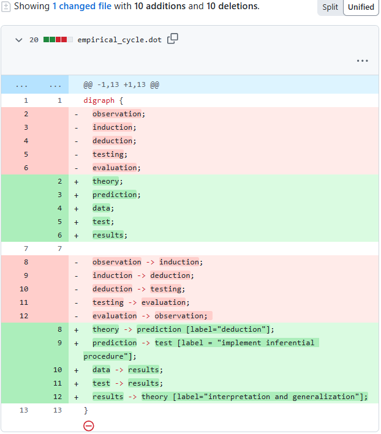

```{r setup, include = FALSE}
library("papaja")
r_refs("r-references.bib")
```

```{r analysis-preferences}
# Seed for random number generation
set.seed(42)
knitr::opts_chunk$set(cache.extra = knitr::rand_seed)
```


<span id="whatsfair">The FAIR Guiding Principles (hereafter: FAIR principles) were established by a diverse consortium of stakeholders to improve the reusability of research data and other resources produced in the course of scholarly work
by making them Findable, Accessible, Interoperable and Reusable [@wilkinsonFAIRGuidingPrinciples2016]^[[As the colloquial use of these terms differs from their definition according to the FAIR principles, we capitalize these terms when referring to specific FAIR principles.]{#faircap}].
Since the FAIR principles' inception, 
they have become a widely adopted standard for archival of academic output,
representing an estimated tens of billions of dollars in reuse value [@vogtFAIR20Extending2024].
Scholars have demonstrated their relevance for making other digital objects more open, including research software [@lamprechtFAIRPrinciplesResearch2019] and computational workflows [@wilkinson2024applying; @vanlissaWORCSWorkflowOpen2021].</span>
The present paper argues that the FAIR principles can similarly advance effective and transparent scholarly communication about theory.
To this end, we introduce "FAIR theory":
a digital instantiation of scientific theory, published as a self-contained and citable digital object distinct from - but potentially associated with - the scientific paper.
<span id="alldefinitions">Definitions of theory abound and hotly debated,
but as many of them are compatible with the FAIR principles,
this paper is not limited to a specific definition.</span>
FAIR theory can potentially improve the transparency and efficiency of scholarly communication, reduce research waste, and accelerate cumulative knowledge acquisition.
We focus on applications in psychology, but the principles are relevant across the social sciences and beyond.

## The Need for FAIR theory

The so-called "replication crisis" has prompted extensive scientific reforms [@lavelleWhenCrisisBecomes2021; @scheelWhyMostPsychological2022].
Concern that the abundance of non-replicable findings 
was caused by undisclosed flexibility in analyses led to widespread adoption of open science practices like preregistration and replication [@nosekPromotingOpenResearch2015].
These various practices ensure transparent and repeated testing of hypotheses by committing to an analysis plan in advance.
However, recent reviews show that most preregistered hypothesis tests are not supported by empirical evidence [@scheelExcessPositiveResults2021].

Thus, increased rigor in testing has revealed that the root cause of the replication crisis is more fundamental:
Psychological theories rarely provide hypotheses that are corroborated by evidence.
Furthermore, theories are often so ambiguous that they can accommodate mutually inconsistent findings,
rendering them immune to falsification.
Consider "self-determination theory" [SDT, @deciSelfDeterminationTheory2012], one of the most widely cited social psychological theories, which we formalized and FAIRified in [this vignette](https://cjvanlissa.github.io/theorytools/articles/formalizing_sdt.html).
SDT emphasizes the role of intrinsic and extrinsic motivation in human behavior.
Intrinsic motivation was initially defined as engaging in an activity purely for the inherent satisfaction it provides, free from any external rewards or pressures [@deciEffectsExternallyMediated1971].
Over time, however, this definition expanded to include motivations driven by the fulfillment of basic psychological needs for autonomy, competence, and relatedness [@ryanSelfdeterminationTheoryFacilitation2000].
The implications of these shifting definitions becomes clear when deriving hypotheses about the type of motivation involved in changing an infant's dirty diaper.
Under the original definition, one would hypothesize that caregivers are not intrinsically motivated to change diapers, as this is hardly a joyous experience.
Under the expanded definition, one would hypothesize the opposite, as the act fulfills the need for relatedness.
Expanding the definition thus enables SDT to absorb potentially falsifying evidence.

Scholars have raised concerns about the state of theory in psychology for nearly 50 years [@robinaughInvisibleHandsFine2021; @meehlTheoreticalRisksTabular1978].
One frequently raised concern is that theories lack *formalization* [@szollosiArrestedTheoryDevelopment2021].
When theories are ambiguous,
precise predictions cannot be derived from them without
resorting to subjective interpretation or invoking additional assumptions,
which makes them harder to falsify.
A second concern has received less attention,
is the lack of transparent and participative scholarly communication about psychological theory, which limits its progression and development.
Despite these concerns, scientific reform initiated by the open science movement has focused primarily on improving deductive methods.
The equally critical processes of theory construction and improvement have been largely overlooked.
The present paper addresses this knowledge gap by applying, for the first time,
open science principles to psychological theory.
We introduce *FAIR theory* as a methodology that can facilitate transparent scholarly communication and accelerate cumulative knowledge acquisition.

## What is Theory?

Given that a pluriformity of definitions are consistent with FAIR theory principles,
we do not limited ourselves to any one particular definition - although, at times, our writing inevitably reveals a particular vantage point.
Perspectives on scientific theory have been categorized as syntactic, semantic, and pragmatic [@scientifictheories].
The syntactic view describes theories as "sets of sentences in a given logical domain language" [@scientifictheories, ch. 2],
acknowledging that each domain (a scientific field, such as psychology or physics) has its own theoretical vocabulary.
We recognize the syntactic view in Meehl's [-@meehlAppraisingAmendingTheories1990] hierarchy of ever-more specific "statements" a theory might contain (Table \@ref(tab:tabmeehl)):
statements about the types of entities postulated (i.e., ontology),
statements about causal connections between those entities,
statements about the functional form of those connections,
and statements about their specific numerical values [@frankenhuisStrategicAmbiguitySocial2023; @guestWhatMakesGood2024].
The semantic view challenges the necessity of distinct domain languages for different scientific fields, and instead advocates for formalizing theories using mathematics.
It shifts the focus from theories as collections of sentences to mathematical models.
The term "model" is not uniquely defined within the literature;
models have been described as "specific instantiations of theories, narrower in scope and often more concrete, commonly applied to a particular aspect of a given theory" [@friedTheoriesModelsWhat2020, p. 336].
This implies that theories and models are not fundamentally distinct, but rather, that for each model, there is a more general theory that subsumes it (one person's model is another person's theory).
The pragmatic view holds that there might not be one structure or definition of scientific theories, but instead, definitions differ across scientific domains.
It also argues that nonformal aspects (e.g. commonly used analogies) and practices (e.g. experimental designs) can be an important part of scientific theories.


## Theory and Scientific Progress

According to the *empirical cycle* [@degrootMethodologyFoundationsInference1969],
a meta-theoretical model of cumulative knowledge acquisition,
research ideally follows a cyclical process with two phases, see Figure \@ref(fig:figecs)a.
In one half of the cycle, labeled the "Context of Justification" by Wagenmakers and colleagues, hypotheses derived from theory are tested on data [-@wagenmakersCreativityVerificationCyclePsychological2018]. In the other half of the cycle (the "Context of Discovery"),
patterns observed in data are generalized to theoretical principles, Figure \@ref(fig:figecs)b.
In this model, theories are the vehicle of scientists' understanding of phenomena.
Ideally, they are iteratively updated based on deductive testing and inductive theory construction.

```{r include = FALSE}
library(DiagrammeR)
library(DiagrammeRsvg)
library(rsvg)
ec_groot <- grViz(diagram = 
'digraph neato { node [fontsize = 6]; 
    edge [fontsize = 6];
    overlap = false; fontsize = 7;
  graph [layout = neato]
  
  observation [pos = "2,3!"];
  induction [pos = "3,2!"];
  deduction [pos = "3,1!"];
  test [pos = "1,1!"];
  evaluation [pos = "1,2!"];
  
  observation -> induction;
  induction -> deduction;
  deduction -> test;
  test -> evaluation;
  evaluation -> observation;
  
}')
ec_wagenmakers <- grViz(diagram = 
'digraph neato { node [fontsize = 6]; 
    edge [fontsize = 6];
    overlap = false; fontsize = 7;
  graph [layout = neato]
  
  subgraph cluster_discovery {
    label="Discovery";
    induction [label="New hypothesis" pos = "3,2!"];
    deduction [label="New prediction" pos = "3,1!"];
  }
  observation  [label="Old knowledge and old data" pos = "2,3!"];
  subgraph cluster_justification {
    label="Justification";
    test [label="Test on new data" pos = "1,1!"];
    evaluation [pos = "1,2!"];
  }

  observation -> induction [label="Speculate & explore" labeljust=r];
  induction -> deduction  [label="Deduce"];
  deduction -> test  [label="Design new experiment"];
  test -> evaluation  [label="Statistical analysis"];
  evaluation -> observation  [label="Knowledge accumulation"];

}')
ec_lissa <- grViz(diagram = 
'digraph neato { node [fontsize = 6]; 
    edge [fontsize = 6];
    overlap = false; fontsize = 7;
  graph [layout = neato]

  theory [pos = "2,3!"];
  prediction [pos = "3,2!"];
  data [pos = "1,1!"];
  test [pos = "2,1!"];
  results [pos = "1,2!"];
  
  theory -> prediction [label="deduction"];
  prediction -> test [label = "implement inferential procedure"];
  data -> results;
  test -> results [label = "evaluate reproducible code"];
  results -> theory [label="interpretation and generalization"];

}')
rsvg_svg(charToRaw(export_svg(ec_groot)), "ec_groot.svg")
rsvg_svg(charToRaw(export_svg(ec_wagenmakers)), "ec_wagenmakers.svg")
rsvg_svg(charToRaw(export_svg(ec_lissa)), "ec_lissa.svg")
rsvg_pdf(charToRaw(export_svg(ec_groot)), "ec_groot.pdf")
rsvg_pdf(charToRaw(export_svg(ec_wagenmakers)), "ec_wagenmakers.pdf")
rsvg_pdf(charToRaw(export_svg(ec_lissa)), "ec_lissa.pdf")

rsvg_png(charToRaw(export_svg(ec_groot)), "ec_groot.png")
rsvg_png(charToRaw(export_svg(ec_wagenmakers)), "ec_wagenmakers.png")
rsvg_png(charToRaw(export_svg(ec_lissa)), "ec_lissa.png")
```

```{r, eval = FALSE, out.width = "32%", fig.cap='Three implementations of the "empirical cycle".', fig.subcap=c('De Groot, 1969', 'Wagenmakers et al., 2018', 'Van Lissa, 2025')}
knitr::include_graphics("ec_groot.pdf")
knitr::include_graphics("ec_wagenmakers.pdf")
knitr::include_graphics("ec_lissa.pdf")
```

```{r figecs, eval = TRUE, fig.cap='Three implementations of the "empirical cycle" [@degrootMethodologyFoundationsInference1969].'}
# rsvg::rsvg_pdf("empirical_cycle2.svg", "ec_visio.pdf")
knitr::include_graphics("ec_visio.pdf")
```


```{r}
library(tidySEM)
library(ggplot2)
y_spacing <- .5
lo <- get_layout("", "A", "",
                 "D", "", "B",
                 "", "C", "", rows = 3)

edg <- data.frame(from = c("A", "B", "C", "D"),
                  to = c("B", "C", "D", "A")
)

p <- prepare_graph(layout = lo, edges = edg)
p$edges[] <- lapply(p$edges, unlist)
p$edges$connect_from <- list("right", "bottom", "left", "top")
p$edges$connect_to <- list("top", "right", "bottom", "left")
p$edges$curvature <- c(rep(60, 4))
p$edges$label <- c("deduction", "testing", "induction", "generalization")
p$edges$label_colour <- "gray50"
p$edges$colour <- "gray50"

p$nodes$label <- c("Theory", "Hypothesis", "Data", "Observed\npatterns")

p_old <- p
g <- plot(p)

topofplot <- max(p$nodes$node_ymax)

headers <- data.frame(
  x = c(3, 5),
  y = topofplot + 2*y_spacing,
  lab = c("Inductive phase", "Deductive phase")
)

letters <- p$nodes[, c("name", "x", "y")]
letters$y <- letters$y+.26
letters$x <- letters$x+.5
g <- g + geom_hline(yintercept = topofplot+y_spacing) +
  geom_vline(xintercept = median(p$nodes$x), linetype = 5) +
  geom_text(data = headers, aes(x = x, y = y, label = lab), vjust = 1) +
  #geom_label(data = letters, aes(x = x, y = y, label = name), fill = "lightblue") +
  scale_x_continuous(expand = c(0,0))+
  scale_y_continuous(expand = c(0,0))
g$layers <- g$layers[c(9, 1:8, 10:length(g$layers))]
ggsave("empirical_cycle.pdf", g, device = "pdf", width = 200, height = 200, units = "mm")
```

```{r figec, eval = FALSE, fig.cap="A take on the empirical cycle by De Groot"}
knitr::include_graphics("empirical_cycle.pdf")
```

In a progressive research program [@lakatosHistoryScienceIts1971],
this cycle is regularly completed to iteratively advance our understanding of the studied phenomena.
There are, however, indications that contemporary psychology falls short of this ideal.
Meehl observed that theories in psychology "lack the cumulative character of scientific knowledge. They tend neither to be refuted nor corroborated, but instead merely fade away as people lose interest" [@meehlTheoreticalRisksTabular1978, p. 1].
Recent empirical findings confirm this view.
Firstly, because hypothesis-testing research is vastly over-represented in the literature, amounting to 89.6% of published papers [@kuhbergerPublicationBiasPsychology2014].
Closer examination of such studies reveals, however, that the link between theory and hypothesis is often tenuous or absent [@scheelWhyHypothesisTesters2021; @oberauerAddressingTheoryCrisis2019].
Only 15% of hypothesis-testing studies referenced any theory,
and rarely in direct relation to the hypothesis [@mcphetresDecadeTheoryReflected2021].
Theory thus has an uncomfortable and paradoxical role in contemporary psychology:
The majority of papers ostensibly test hypotheses,
but these are rarely connected to theory.

Perhaps some ungrounded hypotheses are rooted in implicit theories privy only to the author,
in which case it would be useful to make these explicit [@friedTheoriesModelsWhat2020; @norouziCapturingCausalClaims2024].
Or, perhaps some hypotheses are not of substantive interest, but merely reported as part of entrenched cultural practices [@gigerenzerNullRitualWhat2004],
such as straw-man null hypotheses that exist solely for the purpose of being rejected [@vanlissaTeachersCornerEvaluating2020].
<span id = "waste">Testing ad-hoc hypotheses not grounded in theory, or grounded in misinterpreted- or multi-interpretable theory,
cannot advance our principled understanding of psychological phenomena,
and consequently contributes to research waste [@nakagawaPoorHypothesesResearch2024].
<span id = "norms">Collecting significance statements about ad-hoc hypotheses is much like trying to write novels by collecting sentences from randomly generated letter strings [@vanrooijTheoryTestHow2021]; inefficient at best, and more likely, futile.
As the Declaration of Helsinki prescribes that ethical (medical) research with human participants must "avoid research waste",
our field should take seriously its ethical responsibility to develop procedures to reduce it.</span></span>
The present paper does so by introducing procedures to improve transparent and unambiguous communication about theory; 
instantiating theory as a digital "object" that scholars can access, reuse, and update in their daily workflows.

## Making Theory FAIR

Merely publishing theory in a journal article does not make it open;
to be open, theory should adhere to established open science standards for specification and archival.
We propose to implement theories as digital objects,
and archive these with appropriate metadata in a FAIR-compliant repository (e.g., Zenodo).
Metadata are "data about the data". 
They provide information about the nature and content of a digital object and are stored in the repository where the version of record of the FAIR theory is deposited.
FAIR theories are *Findable* via a DOI or by searching the repository they are archived in;
*Accessible* in a machine- and human-readable filetype;
*Interoperable* for specific purposes, for example, within the data analysis environment;
and *Reusable* in the practical and legal sense, so that they may be iteratively improved by the author or by others.
Following the original proposal of Lamprecht and colleagues [-@lamprechtFAIRPrinciplesResearch2019],
we adapt the FAIR principles for theory, see [Supplemental Table S1](https://github.com/cjvanlissa/fair_theory/blob/main/fair_principles.csv).
We reflect on the necessary (minor) changes,
as well as on the current state and future of FAIR theory in psychology.
The resulting principles provide guidance for instantiating theory as a FAIR digital object,
and we provide worked examples to encourage their adoption.

```{r tabfair, eval = FALSE}
tab_fair <- read.csv("fair_principles.csv", stringsAsFactors = FALSE)[, c("Criterion", "Original", "Theory", "Our.action")]
names(tab_fair) <- c("Criterion", "Original", "Theory", "Action")
papaja::apa_table(tab_fair, landscape = TRUE, align = "m{.1\\linewidth}m{.35\\linewidth}m{.35\\linewidth}m{.15\\linewidth}")
```

### What to Archive?

It is best left to the scholarly community to decide which parts of theory, models, or other aspects should be archived as FAIR theory. 
As the practice of FAIRification becomes more embedded,
we expect that it will become increasingly clear what kind of information is useful.
As a particular FAIR theory evolves, details may be added, and the nature of the information tracked might even change.
For example, following Meehl, we could envision a theory that starts out with establishing, through observation, an ontology of constructs relevant for a given phenomenon.
After initial exploratory research, the theory might be further specified by making assumptions about how these constructs are causally connected.
Over time, more precise *statistical/mathematical models* could be derived by further assuming a specific functional form for relationships (e.g., linear effects) and error families for the distribution of measured variables (e.g., normal distributions).
This allows for the specification of statistical models, which make just enough assumptions to allow the estimation of the remaining unknown parameters (e.g., regression slopes) from data.
Going even further, a *generative/computational model* could be specified,
which is completely parameterized (e.g., specific values of regression slopes are also assumed) such that an interpreter (e.g., the R programming language) can use the model to generate new data.
Also, aspects of scientific practice might be added over time - either to the theory itself, or as references recorded in the theory metadata.
Examples include experimental designs (e.g., longitudinal designs observing change over time), measurement instruments (e.g., different questionnaires used to assess the same construct), or information about participant recruitment- and retention strategies.

Theories can include or reference other theories.
For example, consider a comprehensive theory of disease spread and pandemics which covers various psychological factors
such as adherence to infection prevention protocols (e.g., social distancing),
pandemic-related behavior (e.g., panic buying),
and pandemic-related distress
[@taylor2022psychology].
Such a theory may encompass a particular transmission _model_ for disease spread including precise parameters for the process of infection (e.g., social distance, average duration of encounters, ventilation) and incubation times.

### The Role of Theory Formalization

Concerns about the state of psychological theory have motivated increasing calls for greater theory "formalization" [@smaldinoModelsAreStupid2017; cf. @oudemaatmanPsychologysTheoryCrisis2021].
Formalization increases theories' falsifiability [@popperLogicScientificDiscovery2002] because it expresses ideas as specific statements, clearly demarcating what should (not) be observed if the theory were true.
For example, Baddeley's verbal description of the phonological loop in his theory of working memory stands out for clarity and comprehensibility, yet it allows for at least 144 different implementations depending on the specification of various parameters such as decay rate, recall success, or rehearsal sequence, which were left undefined in the original theory [@lewandowsky2010computational].
Without committing to specific implementations a-priori,
the theory becomes hard to test.
Compared to theories expressed in natural language,
formal theories facilitate inconsistency checking and evaluation of a theory's (lack of) vagueness.
Committing to specific implementations of the different components, their causal connections, and the functional forms of these relationships makes the theory more precise.
More precise theories are easier to falsify,
which necessitates specific revisions and advances our principled understanding of the phenomena they describe.

Crucially for the present paper, formalization is orthogonal to FAIRification.
FAIR theory imposes no restrictions on the manner in which theories are derived and implemented;
rather, it pertains to rigorous and transparent archival and communication about theories, with the aim of enhancing their reusability.
FAIR theory does not require formalization, and formal theories are not automatically FAIR.
The FAIR principles
apply to theories representated in natural language,
as well as formal theories represented using mathematical notation, algorithmic pseudo code, or a set of logical clauses.
Thus, for example, "grounded theory", derived from qualitative research,
can be represented as a FAIR theory if it is represented as plain-text propositions and archived in a FAIR repository with appropriate metadata.
Conversely, a formal theory is not FAIR if it is confined to a journal article without any key words to identify it as a theory paper (lacking Findability), represented merely as a bitmap image (limiting Accessibility and Interoperability), or behind a paywall (limiting Reusability).
FAIR theory is thus consistent with, but does not require, formalization (also see the section on *Accessibility* below).
This principle is illustrated in our [vignette on FAIRifying De Groot's empirical cycle](https://cjvanlissa.github.io/theorytools/articles/fair-theory.html):
it is equally possible to FAIRify the theory in its original formulation by archiving a text document with five plain-langues propositions,
or to formalize the theory and represent it as a human- and machine-readable diagram before FAIRifying it.

### Modular Publishing

<span id = "modularvalue">The primary unit of scientific communication has long been the academic paper.
Yet scholars often produce many other valuable resources in the process of writing papers,
including instruments, materials, data, code, and theory.
These resources are often merely described in papers and not made available for reuse.
Modular publishing is the practice of making each of these resources available as independent *digital objects*,
facilitating their reuse and making them citable [@vandesompelRethinkingScholarlyCommunication2004].
We envision FAIR theory as an instance of modular publishing [@kirczModularityNextForm1998].
</span>
<span id="datasharing">At the time of writing, some modular publishing practices are already widely adopted;
data sharing, for example, has become the de-facto standard in psychology in the past decade [@tedersooDataSharingPractices2021].</span>

Modular publishing can be achieved by archiving specific resources (including theory) in repositories like [Zenodo](https://zenodo.org/),
which was developed by [CERN](https://home.cern/) under the European Union's [OpenAIRE](https://www.openaire.eu/) program [@zenodo].
To maintain a persistent record of scholarly communication,
Zenodo mints DOIs for digital objects.
<!-- - as does, for example, the [Crossref](https://www.crossref.org/) association, -->
<!-- which is used by many academic publishers. -->
The DataCite Metadata Schema offers a standard way to document digital objects with relevant metadata which increases their findability and documents their relationships to other resources [@datacitemetadataworkinggroupDataCiteMetadataSchema2024].
<!-- Platforms like the [Open Science Framework](https://osf.io/) connect these various research infrastructures to offer a more user-friendly front end for open science-related workflows. -->
For example, data can be archived in Zenodo with the metadata property `resourceType: dataset`.
If the data were collected for a specific paper, that relationship can be cross-referenced with `relationType: IsSupplementTo`.
Similarly, a FAIR theory can be connected to a specific paper by using `relationType: IsDescribedBy`, while the reverse relationship, documented in the canonical reference paper, is `relationType: Describes`.
Other cross-references are useful for documenting relationships between multiple theory objects: If an existing theory is made FAIR without substantial alterations,
the resulting FAIR theory metadata would cross-reference the existing theory as `relationType: IsDerivedFrom`.
If an existing theory is updated, `relationType:IsNewVersionOf` could be used to reference previous versions.
If a variation of an existing FAIR theory is created, cross-reference it with `relationType: IsVariantFormOf`.
<span id="modularpublisingdetract">
Modular publishing of resources, including theories, increases their reuse potential and makes them citable without detracting from the conventional academic paper as a unit of academic communication which allows for greater nuance and the author's voice.
Theories published in traditional papers can be supplemented by FAIR versions that live independently, evolve collaboratively, and feed into reproducible workflows.
</span>

### Version Control

The field of computer science provides inspiration for well-established processes for iteratively improving digital objects.
Version control systems, like Git, are used to iteratively improve computer code, while managing parallel contributions from collaborators and allowing for experimentation and diverging development without losing information.
Git tracks line-by-line changes to text-based files,
and maintains a complete annotated history of those changes.
It has previously been argued that Git is particularly well-suited to academic work [@ramGitCanFacilitate2013; @vanlissaWORCSWorkflowOpen2021].
For example, Git can facilitate reproducible research, manage distributed collaboration, and improve preregistrations [@vanlissaWORCSWorkflowOpen2021; @peikertReproducibleResearchTutorial2021].
Git provides a useful framework for developing FAIR theory,
because it enables explicitly comparing versions of a file (or: theory),
documenting why changes were made,
incorporating changes by different authors,
and branching off into different directions (e.g., competing hypotheses) while retaining an explicit link to the common ancestor.
This makes it possible for meta-scientists to study the provenance of a theory and determine how well different versions of a theory explain empirical evidence [@vanlissaUsingEndpointsCheck2023].
Note that, while cloud archives associated with Git (e.g., GitHub) facilitate collaborative theory development, 
they are not suitable for archiving the version of record due to a lack of FAIR-compliance.
Thus, theory development may take place on GitHub, but versions of record should be archived on a platform like like Zenodo, with appropriate metadata.

### Semantic Versioning

Aside from technical solutions, version control is a social process as well.
On the one hand, regular updates can improve theories - but on the other hand, it risks breaking compatibility between theories and hypotheses derived from them, or compatibility between one theory and others that depend upon it.
For example, if we construct a theory to explain a specific phenomenon, and we cross-reference an existing theory comprising an ontology for our field - that dependency is broken if the ontology is later updated and our phenomenon of interest is removed.
<!-- NvD: Maybe we can add an  example (e.g., the theory that explains ego-depletion and the failed replication of the phenomenon). -->
In computer science, these challenges are navigated by assigning version numbers.
Specifically, *semantic versioning* comprises a simple set of rules for assigning version numbers to digital objects.
Whereas version control tracks changes,
semantic versioning communicates what those changes mean to users of the theory,
guides the social process of theory development, and signals how much a theory has been changed.

We propose adaptating semantic versioning for theories by assigning a version number in the format `MAJOR.MINOR.PATCH` (e.g., 0.1.0), where the `MAJOR` number is incremented when backwards incompatible changes are made. For example, if the theory now contains empirical statements that are at odds with a previous version of the theory. The `MINOR` number should be incremented when the set of empirical statements are expanded in a backward compatible manner (i.e., the previous version is subsumed within the new version). The `PATCH` number should be incremented when making backward compatible bug fixes, cosmetic changes, fix spelling errors, or add clarifications.

# The FAIR Principles

## Findability

Making theories Findable would allow researchers to easily identify relevant theories
and ground their hypotheses in established theoretical foundations.
It further increases the impact and reuse potential of theories across disciplines,
either through direct application (where one discipline stumbles upon a problem that is already well-understood in another discipline),
or through analogical modeling.
In analogical modeling, the structure of a theory from one discipline is applied to a phenomenon in another field.
For example, predator-prey models have inspired theories of intelligence [@vandermaasDynamicalModelGeneral2006], and the Eysenck model of atomic magnetism has inspired a network theory of depression [@cramerMajorDepressionComplex2016].
Findability also enables meta-research on theories, 
in the same way libraries and search engines have enabled scholars to study the literature via systematic reviews.
In a similar way, it would become much easier to explicitly compare different theories of a specific phenomenon,
or to study structural properties of theories.

The four Findability criteria are applicable to theory with only minor adjustments, see [Supplemental Table S1](https://github.com/cjvanlissa/fair_theory/blob/main/fair_principles.csv).
First, this requires assigning a globally unique and persistent identifier, such as a DOI, to each theory (F1).
Of the many services that provide DOIs for archived objects,
Zenodo and the Open Science Framework are commonly used in psychology.
Second, Findable theory is described with rich metadata	(F2).
This includes citation metadata (e.g., referencing a scientific paper that documents the theory, or a psychometric paper that operationalizes specific constructs).
It might further include domain-specific metadata, such as a reference to a taxonomy of psychological constructs [@boscoMetaBUSVehicleFacilitating2017],
ontology [@guyonMeasurementOntologyEpistemology2018],
or catalog of psychological phenomena.
Metadata should also include identifiers for all the versions of the theory it describes	(F3);
Zenodo handles this by default by providing an overarching DOI for a digital object which subsumes the DOIs of its subversions.

Finally, metadata should be registered or indexed in a searchable registry (F4).
It is important to note that, while many archives are technically searchable (e.g., GitHub, FigShare, the Open Science Framework, institutional repositories),
only few are specifically designed for FAIR-compliant archival.
Zenodo stands out in this respect.
Using standardized metadata further improves the Findability of theories archived within FAIR repositories.
The DataCite Metadata Schema provides a controlled vocabulary for research output, and the `resource_type: model` matches the description of FAIR theory [@datacitemetadataworkinggroupDataCiteMetadataSchema2024].
<!-- > An abstract, conceptual, graphical, mathematical or visualization model that represents empirical objects, phenomena, or physical processes. -->
Furthermore, we suggest using the keyword `"fairtheory"` for all resources that constitute or reference (a specific) FAIR theory.
<!-- (separating the words `FAIR` and `theory` by a space or hyphen would lead them to be interpreted as separate tokens in many search engines). -->

Findability is substantially amplified if intended users of a resource know where to search for it.
This is a known problem in relation to research data and software [@katzSpecialIssueSoftware2024].
Regrettably, most academic search engines only index traditional print publications, not other digital objects.
Since the status quo is to publish theories in papers,
the FAIR requirements are met if scholars continue to do so,
and additionally publish theories as separate digital objects.
The `"fairtheory"` keyword can also be used to signal the presence of theory within a paper.
<!-- An ad-hoc solution is to publish a paper as documentation for the digital object [@mcgillivrayDeepImpactStudy2022]. -->
<!-- There is even a journal - the [Journal of Open Source Software](https://joss.theoj.org/) - that publishes software documentation as a paper so that it will be indexed by search engines. -->
<!-- The same solution could be applied to theories. -->
In the longer term, it may not be necessary to write a paper for each theory.
If Zenodo becomes more recognized as a centralized repository for digital objects, researchers may begin to search there more regularly.
Conversely, as organizations (e.g., Google Scholar, Web of Science, Pure, ORCID) begin to recognize other forms of academic output beyond papers, they may begin to index digital objects stored in Zenodo.

There have been notable efforts to improve theories' Findability through post-hoc curation.
For example, Gray and colleagues introduced a format for representing theories,
and posted many examples on [their website](https://www.theorymaps.org) [@grayHowMapTheory2017].
Similarly, [PsychoModels](http://psychomodels.org/) seeks to inventorize theories and models in psychology [@vandongenPsychoModelsMathematicalComputational2025].
Post-hoc curation is a notable effort but does not address the root cause of the lack of Findability.
Ideally, Findability would be addressed ante-hoc, through documentation with rich metadata and modular publishing.
Both approaches can be complementary, however.
For example, post-hoc curation could make use of existing FAIR-compliant archival infrastructure like Zenodo.
The data engineering adage "Lots of Copies Keeps Stuff Safe" (LOCKSS) implies that it is fine to archive theories in multiple places,
although it is advisable to make use of automatic integration (as exists between GitHub, Zenodo, and OSF) to avoid the need to maintain information in multiple places, which increases the risk of inconsistencies arising.

## Accessibility

Transparent scholarly communication about theory requires that theories are Accessible to all researchers and other stakeholders.
If theories are not Accessible, researchers cannot reuse and refine them. <!-- NvD: the original was logically unsound. Accessibility is necessary for reuse, but not sufficient, right?) --> 
Thus, Accessibility can accelerate cumulative knowledge acquisition.
Making theories Accessible also allows stakeholders (e.g., practitioners, policymakers, advocates) to inform themselves of the current scientific understanding of specific phenomena.
While isolated empirical findings can appear fragmented and contradictory [@dumas-malletPoorReplicationValidity2017],
theories offer a top-down, big-picture representation of the phenomena studied in a field.
In other words, theories are an important instrument in science communication.

The Accessibility principles 
<!-- are sometimes misunderstood as pertaining to *maximizing* access; rather, they should be understood as *regulating* it [@landiFAIROpenPossible2020]. -->
<!-- They  -->
apply to theory with minor changes.
Firstly, theory and its associated metadata should be Accessible by their identifier using a standardized communications protocol (A1).
This can be achieved, for example, by hosting theory in a version-controlled remote repository (such as Git), and archiving that repository on Zenodo for long-term storage.
The resulting resource will then have an identifier (DOI) which allows the theory to be accessed using a standardized communications protocol (download via `https` or `git`).
Secondly (A2), theory metadata should be Accessible, even when the theory is no longer available,
which is also achieved via long-term storage (e.g., on Zenodo).
Git remote repositories allow for access control,
and Zenodo allows for access control of individual files/resources.
<!-- An unavailable theory typically refers to a theory that was abandoned in favor of a better or more general theory (such as the phlogiston theory, which was superseded by the oxygen theory). -->
In general, it makes sense to retain outdated theories, in order to be able to track the genesis of theories over time, yet, we require the availability of meta data as a minimum requirement.

At present, there are several impediments to theories' Accessibility.
First, when theories are published in paywalled journal articles,
they might not be practically Accessible to all,
even if they are in principle Accessible to paying readers.
Open Access publishing increases the practical Accessibility of all academic output, including theory.
A second impediment is more indirect
and pertains to a theory's intelligibility to those with practical Access.
It has been proposed that good theories have the property of "discursive survival [...], the ability to be understood" [@guestWhatMakesGood2024, p. 1]. 
At present, psychological theories are often ambiguous, rendering them difficult to understand [@frankenhuisStrategicAmbiguitySocial2023].
Successful communication requires shared background knowledge between sender and receiver [@vogtFAIR20Extending2024].
This can come from shared paradigms [@kuhnStructureScientificRevolutions2009],
from education, and from the available methods and instrumentation - or it can be problematically absent.
Accessibility is improved by explicitly referring to sources of assumed background knowledge, and by reducing unnecessary ambiguity.
At the same time, it is important to acknowledge that it is impossible to remove *all* ambiguity when communicating an idea.
The *indeterminacy of translation* holds that every communicative utterance (e.g., a statement in natural language, a mathematical formula) has multiple alternative translations,
with no objective means of choosing the correct one [@quineReasonsIndeterminacyTranslation1970].
This places a theoretical upper bound on theories' ability to be understood.

A third impediment arises when theories have, what we call, a "dependency on the author" (DOA).
DOA occurs when a theory cannot be understood by independent scholars,
requiring the original author to provide interpretation and clarification.
<!-- We have heard DOA referred to apocryphally as the "ask Leon" phenomenon, -->
<!-- as graduate students were supposedly told to ask Leon Festinger to explain to them how their misconstrual of cognitive dissonance theory had caused their experiments to yield null results. -->
DOA relates to the discourse on "Great Man Theorizing" [@guestWhatMakesGood2024] because it enables gatekeeping: an author could insist that work requires their involvement or denounce work conducted outside their purview as illegitimate,
which violates checks and balances of scientific research.
DOA also renders theories immune to refutation,
because the author can claim that the theory was misconstrued when confronted with falsifying evidence, thus making it a moving target  [@szollosiArrestedTheoryDevelopment2021].
DOA is inherently problematic, as illustrated by cases where third parties identify logical inconsistencies within a theory [e.g., @kissnerIDENTIFICATIONLOGICALINCONSISTENCY2008].
This example demonstrates that original authors are not the ultimate authority on their theories.
DOA thus unduly impedes scientific progress.
<!-- DOA thus unduly impedes scientific progress, and authors should make good-faith efforts to make theories as Accessible as possible, in terms of both availability and interoperability. -->
<!-- NvD: Above we mention that "The Accessibility principles are sometimes misunderstood as pertaining to *maximizing* access; rather, they should be understood as *regulating* it." This feels a bit at odds. I suspect that we are not talking about the same thing here, this could be interpreted as a contradiction.  -->


In sum, authors should make good-faith efforts to make theories as Accessible as possible, in terms of both availability, intelligibility, and freedom from dependencies that cannot be resolved (including dependencies on the author, or manuscripts that can no longer be accessed with reasonable effort).
While the *indeterminacy of translation* places an upper bound on interpretability,
scholars should nevertheless strive to reduce unnecessary ambiguity to the greatest possible extent.
It may benefit scientific discourse to normalize explicit ambiguity (these are things we don't know yet) and anticipate misunderstanding,
to invite others to fill in the blanks and motivate ever further explication of theory.
A theory's Accessibility is increased by
reducing dependencies on (implicit) background knowledge,
explication of assumptions,
formalization,
and explicit cross-references to relevant resources such as papers, ontologies, other related theories, measurement instruments, experimental designs [@langeChecklistIncentivizingFacilitating2025a].
<!-- The data usually need to be integrated with other data. In addition, the data need to Interoperate with applications or workflows for analysis, storage, and processing. -->

## Interoperability

Interoperability pertains to the property of digital objects to "integrate or work together [...] with minimal effort" [@wilkinsonFAIRGuidingPrinciples2016, p. 2].
Firstly, theory and its associated metadata should use a formal, accessible, shared and broadly applicable language to facilitate (human- and) machine readability and reuse (I1).
The common practice of instantiating theory as lengthy prose or schematic drawing falls short of this ideal.
Instead, FAIR theory should, ad minimum,
be instantiated in a human- and machine-readable datatype,
as should all digital objects created while performing scholarly work [@vanlissaWORCSWorkflowOpen2021].
Depending on the level of formalization of the theory,
different formats may be appropriate,
such as verbal statements in plain text,
mathematical formulae,
and statements expressed in some formal language.
Examples of the latter include pseudo-code,
interpretable computer code,
and Gray's theory maps [@grayHowMapTheory2017].
While a theory represented as a bitmap image is not very Interoperable,
the same image represented in the DOT language [@DOTLanguage2024]
for representing graphs does meet this ideal.

Secondly, theory (meta)data should use vocabularies that follow FAIR principles (I2).
Aside from the aforementioned Datacite metadata schema [@datacitemetadataworkinggroupDataCiteMetadataSchema2024],
in the context of theory, this highlights the importance of establishing standardized ontologies.
Thirdly, theory (meta)data should include qualified references to other (meta)data, including previous versions of the theory (I3).
The first part of this principle allows for nested theories;
for example, a theory that specifies causal relationships between constructs could refer back to an ontological theory from which those constructs are derived.
This can be achieved by cross-referencing the DOI of those nested theories [@dataciteContributingCitationsReferences2024].
The second part of this principle allows for tracing the provenance of a theory; keeping track of its prior versions and other theories that inspired it.
This is achieved by using Git for version control and Zenodo for archiving.
Git tracks the internal provenance of a theory repository; Zenodo is used to cross-reference external relationships (e.g., papers that influenced the theory, previous theories that inspired it, models based upon the theory).

Recent work points out that Interoperability is not an all-or-nothing property.
The concept of X-Interoperability was introduced to answer the question: *Interoperable for what?*
X-Interoperability is defined as facilitating "successful communication between machines and between humans and machines [, where] A and B are considered X-Interoperable if a common operation X exists that can be applied to both" [@vogtFAIR20Extending2024, p. 5].
This revised definition makes it possible to outline a theory's affordances in terms of X-Interoperability.
For example, a FAIR theory may be X-Interoperable for deriving testable hypotheses,
or for the purpose of selecting relevant control variables,
or for the purpose of indicating the conditions necessary for observing a particular phenomenon.
If we consider Meehl's nine properties of strong theories (properties 3-8 are grouped because they all refer to functional form),
we see how each of these properties incurs certain affordances in terms of X-Interoperability (Table \@ref(tab:tabmeehl)).

```{r tabmeehl}
tab_meehl <- data.frame(
  "Property" = c("1) Ontology", "2) Causal connections", "3-8) Functional Form", "9) Numerical Value"),
  "X-Interoperability" = c("Variable selection", "Model specification, covariate selection, causal inference", "Deriving specific hypotheses", "Simulating data"), check.names = FALSE
)
write.csv(tab_meehl, "tab_meehl.csv")
papaja::apa_table(tab_meehl)
```


<!-- Do we want to say something about this?
Interoperability of psychological theory may be limited when theories are instantiated in natural language without consideration of ontological complexities. -->
<!-- or as visualizations without a straightforward interpretation -->
<!-- What can go wrong? A well-formed sentence may be logically inconsistent (e.g., the theory that conceptualized father involvement simultaneously as mediator and moderator); a picture may seem sensible but there's no straightforward way to translate it to hypotheses, etc. -->
<!-- which are not machine-readable and l -->

With regard to the state of Interoperability in psychology, 
Kurt Lewin's [-@lewinPsychologyProcessGroup1943] adage "there's nothing as practical as a good theory" paints a hopeful picture of theories as useful tools in psychological researchers' day-to-day work.
But, as we argued, contemporary practice falls short of this ideal.
The examples of X-Interoperability offered in Table \@ref(tab:tabmeehl) illustrate that much can be gained by integrating theory directly into analysis workflows, and by making theory X-Interoperable within software used for analysis.
For example, Interoperable theory could be used
to select control variables for causal inference [@cinelliCrashCourseGood2022],
or to preregister a study with an explicit derivation chain from theory to hypothesis,
as well as an inferential procedure that would suggest specific modifications to theory after analyzing empirical data [@peikertReproducibleResearchTutorial2021],
or to derive machine-readable hypotheses [@lakensImprovingTransparencyFalsifiability2021] which could be automatically evaluated through integration testing [@vanlissaUsingEndpointsCheck2023].
Furthermore, theories can be X-Interoperable with each other to enable nesting, or using one theory to clarify elements of another theory.
For example, it should be possible to embed a theory about emotion regulation [e.g., @grossEmotionRegulationCurrent2015] within a theory of emotion regulation development [@morrisRoleFamilyContext2007].

## Reusability

If we take cumulative knowledge acquisition to be a goal of scientific research, then Reusability is the ultimate purpose of making theory FAIR.
Applied to FAIR theory, reusability requires that  each theory and its associated metadata are richly described with a plurality of accurate and relevant attributes (R1) with a clear and Accessible license for reuse (R1.1).
It should further have detailed provenance (R1.2), 
which is achieved through version control with Git and archival on Zenodo.
Finally, the (meta)data which meets domain-relevant community standards (R1.3).
The Datacite metadata schema offers an initial template in this regard,
and this paper takes one step towards establishing more fine-grained community standards for FAIR theory.
[This is an example of FAIR metadata](https://github.com/cjvanlissa/fair_theory/blob/3b4894da576cb76d19e911a05dd513d5172058ec/example_metadata.json) extracted from Zenodo.

If we consider the current state of Reusability in psychological theory, there appears to be a norm against theory reuse:
"[Theories are] like toothbrushes — no self-respecting person wants to use anyone else's" [@mischelToothbrushProblem2008, p. 1].
As cumulative knowledge acquisition requires reusable theories that are continuously updated based on insights from new data, such a norm impedes scientific progress [@degrootMethodologyFoundationsInference1969].
In FAIR theory workshops, we similarly notice a reluctance to reuse and adapt existing theories.
Students ask questions such as "Who owns a theory?",
and "Who determines how a theory may be reused or changed?".
These questions imply a norm against modifying theory without its author's consent, reminiscent of the aforementioned problem of dependency on the author.

Licensing theories for reuse unambiguously answers these questions,
with the caveats that legislation may vary across contexts and jurisdictions, and that this paper does not constitute legal advice.
Two considerations are important when determining what license is appropriate for theory.
A first consideration is that copyright law protects authors' rights according to the idea-expression dichotomy [@bently2010copyright].
Copyright does not
"extend to any idea, procedure, process, system, method of operation, concept, principle, or discovery" (Section 102, Copyright Act).
Copyright thus applies to creative works expressing a theory (e.g., prose, visual illustrations),
but not to the underlying theoretical idea.
It thus seems that theories expressed in prose or depicted visually - in other words, that fall short of the Accessibility criterion - are more likely to qualify for copyright protection than formal theories.
<!-- If copyright limits Reusability and does not cover ideas in their purest form (like formal theories), -->
<!-- then it might be counterproductive and possibly misleading to adopt a license that assumes copyright protection. -->
A second consideration is that academic research is covered under "fair use" exemptions to copyright.
<!-- so copyright would pose few restrictions to Reusability in scholarly communication. -->
Given these two considerations - that copyright does not protect ideas in their purest form and that academic use offers exemptions to copyright - it may be counterproductive and possibly misleading to adopt a license that assumes copyright protection to theories.
For psychological theories without commercial aspects, we suggest using a licence that explicitly waives copyright and encourages Reusability,
such as CC0 (no rights reserved).

Aside from legal conditions for reuse, there are also social considerations.
For example, while a CC0 license does not legally mandate attribution,
the norms of good scientific practice mandate that scholars comprehensively cite theory and related works [@aalbersbergMakingScienceTransparent2018].
Particularly when FAIRifying an existing theory, failing to credit its author amounts to scientific malpractice.
Another instrument for guiding the social process of (diffuse) collaboration is to include a "README" file in the theory repository, which informs users about the ways in which they can reuse and contribute to a FAIR theory.
A final suggestion is to create or adopt a "Code of Conduct" which prescribes behavioral norms for contributors and users of a theory [@ehmkeContributorCovenantCode2014].

# FAIR Theory Workflow

<span id="tutorial">We present a conceptual workflow for making theory FAIR,
to give readers some sense of the steps involved. 
While these steps can be implemented using a variety of tools,
the `theorytools` R-package automates most steps.
This package includes a [worked example for implementing this workflow](https://cjvanlissa.github.io/theorytools/articles/fair-theory.html) which, as a living document,
can be kept up-to-date with changing infrastructures.
The package further includes tutorial examples for FAIR theory creation based on existing substantive theories, including
an example of how to formalize and FAIRify Decy and Ryan's [*Self-Determination Theory*](https://cjvanlissa.github.io/theorytools/articles/formalizing_sdt.html) [@ryanSelfdeterminationTheoryFacilitation2000],
how to FAIRify and Morris' [*Tripartite Model*](https://cjvanlissa.github.io/theorytools/articles/causal-inference.html) of parental socialization of children's emotions [@morrisRoleFamilyContext2007] and use it for causal inference,
and an example of how to [FAIRify a mathematical model based on the Dunning-Kruger effect](https://cjvanlissa.github.io/theorytools/articles/dunning-kruger.html) [@feldEstimatingRelationshipSkill2017]. 

To prevent the emergence of an open science "cottage industry",
we recommend using existing open science infrastructures to the greatest possible extent.
At the time of writing (2025),
the integration of GitHub and Zenodo makes for a particularly user-friendly approach that meets *all* FAIR principles.
Zenodo and GitHub are both integrated with the Open Science Framework (OSF),
a popular platform in psychology.
Thus, it is possible to create a project page on the OSF to increase the visibility of a FAIR theory among users of that platform,
while the integration of the OSF with Zenodo and GitHub removes the need for maintaining the same information on multiple platforms.
Note that open science infrastructure is an area of active development, and as such,
workflows might change as new tools or databases are developed or existing tools and database change over time.

## 1. Implement the Theory 

Imagine that one would want to FAIRify De Groot's *empirical cycle*,
a meta-theory of theory construction.
Begin by creating an empty folder to hold all files associated with the theory - this folder will become the theory archive.
The first file to create is the theory itself.
This could be a plain-text file containing natural language statements,
or a more formal representation, such as a directed graph.
For example, the empirical cycle was originally described as a series of natural language statements [@degrootMethodologyFoundationsInference1969, p. 28]:

> *Phase 1:* 'Observation': collection and grouping of empirical materials; (tentative) formation of hypotheses.  
*Phase 2:* 'Induction': formulation of hypotheses.  
*Phase 3:* 'Deduction': derivation of specific consequences from the hypotheses, in the form of testable predictions.  
*Phase 4:* 'Testing': of the hypotheses against new empirical materials, by way of checking whether or not the predictions are fulfilled.  
*Phase 5:* 'Evaluation': of the outcome of the testing procedure with respect to the hypotheses or theories stated, as well as with a view to subsequent, continued or related, investigations.

Implementing the theory as a digital object can be as simple as saving these statements to a plain text file.

Optionally, we can formalize the theory further.
According to a taxonomy of different levels of theory formalization [@guestHowComputationalModeling2021],
the empirical cycle is currently defined at either the "theory" or "specification" level.
To fulfill criterion I1 of the FAIR principles: using a formal language for knowledge representation [see Supplemental Table S1](https://github.com/cjvanlissa/fair_theory/blob/main/fair_principles.csv)), we can further formalize it to the "implementation" level by specifying it in the DOT language for describing directed graphs^[Presented here in a simplified form; see the [tutorial](https://cjvanlissa.github.io/theorytools/articles/fair-theory.html) for technical details].
Given the cyclical nature of the conceptual model, such an implementation might look like this:

<!-- ``` -->
<!--   induction   [label="formulation of hypotheses"]; -->
<!--   deduction   [label="derivation of specific consequences from the hypotheses, -->
<!--                       in the form of testable predictions"]; -->
<!--   observation [label="collection and grouping of empirical materials; -->
<!--                       (tentative) formation of hypotheses"]; -->
<!--   test        [label="of the hypotheses against new empirical materials, by way -->
<!--                       of checking whether or not the predictions are fulfilled"]; -->
<!--   evaluation  [label="of the outcome of the testing procedure with respect to -->
<!--                       the hypotheses or theories stated, as well as with a view -->
<!--                       to subsequent, continued or related, investigations"]; -->

<!--   observation -> induction; -->
<!--   induction -> deduction; -->
<!--   deduction -> test; -->
<!--   test -> evaluation; -->
<!--   evaluation -> observation; -->
<!-- ``` -->

```
induction;
deduction;
observation;
test;
evaluation;

observation -> induction;
induction -> deduction;
deduction -> test;
test -> evaluation;
evaluation -> observation;
```

Note that the first part of the implementation constitutes an ontology - it specifies the entities comprised in the theory.
The second part of the implementation describes the flow of information from phase to phase.
Figure \@ref(fig:figecs)a) shows what this implementation looks like when plotted.
Regardless of which implementation we prefer,
we can save it to a plain text file - this is the "digital object" containing our theory.

## 2. Document the Theory

To meet the Interoperability and Reusability criteria,
it is important to properly document the theory file.
Firstly, add a README.md file with instructions for future users of your theory.
The `theorytools` package contains a [vignette](https://cjvanlissa.github.io/theorytools/articles/readme.html) on writing README files for theory.
Secondly, add a LICENSE file with the legal conditions for reuse.
We recommend explicitly waiving copyright with the `CC0` license, but other options are available, see [https://choosealicense.com](https://choosealicense.com/non-software/).

## 3. Version Control the Theory Archive

To track all changes to our theory, the theory archive can be version controlled.
[Git](https://git-scm.com/book/en/v2/Getting-Started-Installing-Git) is well-suited for this purpose.
Hosting a backup in the cloud on a platform like [GitHub](https://github.blog/developer-skills/github/beginners-guide-to-github-repositories-how-to-create-your-first-repo/) additionally makes the theory publicly accessible and facilitates community engagement.

## 4. Archive the Theory on Zenodo 

Archiving major versions of a theory in a FAIR-compliant repository that issues a persistent identifier (DOI) improves their Findability and allows them to be referenced in perpetuity.
Zenodo is a FAIR compliant repository with GitHub- and OSF integration.

## 5. Entering Meta-Data

When archiving a FAIR theory, documenting it with relevant metadata improves its Findability.
We recommend using a standardized metadata schema like DataCite [@datacitemetadataworkinggroupDataCiteMetadataSchema2024].
See here for [an example of the metadata](https://github.com/cjvanlissa/fair_theory/blob/3b4894da576cb76d19e911a05dd513d5172058ec/example_metadata.json) associated with our FAIR empirical cycle.
Within this schema,

* Set the `resource type` to `Model`,
* Add the words `FAIR theory:` to the title so that sentient readers will recognize the work as a FAIR theory (just as meta-analyses should use the words `meta-analysis` in the title),
* Add `fairtheory` to the keywords to aid search engine indexation (using "fair theory" causes some search engines to look for either the word "fair" or "theory", which would be overly inclusive).
* Optionally, submit the theory to the ["FAIR Theory Community"](https://zenodo.org/communities/fairtheory) to contribute to community building; communities on Zenodo are shared spaces to manage and curate research outputs.
</span>

The FAIR implementation of De Groot's empirical cycle that resulted from the lead author implementing this workflow is available at <https://doi.org/10.5281/zenodo.14552329>.

## Changing a Theory

An important advantage of FAIR theory is that we can implement different versions of a theory, compare them, and document their cross-relationships.
We can take work that has been done before - in this case, the repository created above, and create an independent copy that we can modify as we wish, while retaining cross-references to the original.
Elaborating on our running example, several authors have reinterpreted De Groot's empirical cycle.
For example, Wagenmakers and colleagues' [-@wagenmakersCreativityVerificationCyclePsychological2018] interpretation of the empirical cycle differs from De Groot's in several ways.
First, the phases of the cycle were renamed, and this change was not described in the paper.
Assuming that Wagenmakers' new labels are meant to illustrate the phases,
not substantially change the ontology,
we could incorporate this change by adding labels to the original ontology.
These labels suggest a focus on empirical psychology that was not present in De Groot's version.
Furthermore, the label "knowledge accumulation" invites the question of exactly *how* knowledge accumulates upon evaluation of a prior experiment.
As this lack of cumulative knowledge acquisition appears to be precisely where contemporary research practice falls short, this ambiguity invites further improvement of the theory.
The authors explicitly mention a second change: *"We added the Whewell-Peirce-Reichenbach distinction between the context of discovery and the context of justification"* (p. 423).
We could implement this change to the original implementation by grouping the respective phases of the cycle;
a minor and tractable change.

```
  {
    label="Discovery";
    induction [label="New hypothesis"];
    deduction [label="New prediction"];
  }
  observation  [label="Old knowledge and old data"];
  {
    label="Justification";
    test [label="Test on new data"];
    evaluation;
  }

  observation -> induction [label="Speculate & explore"];
  induction -> deduction  [label="Deduce"];
  deduction -> test  [label="Design new experiment"];
  test -> evaluation  [label="Statistical analysis"];
  evaluation -> observation  [label="Knowledge accumulation"];

```

The first author was inspired by De Groot as well,
but again specified the empirical cycle differently.
First, in De Groot's formulation, each stage describes a process.
This invites the question of what the concrete outcomes of these processes are.
In other words: what actually changes when going through the cycle, except the scholar's mind?
To address this point, the nodes in Van Lissa's specification (2025) refer to specific deliverables, whereas the edges connecting the nodes refer to processes acting upon those deliverables, see Figure \@ref(fig:figecs)c).
Second, the processes of induction and deduction are perhaps not as neatly confined to specific phases as De Groot proposed.
Theory testing, as takes place in the "context of justification", can be said to involve mostly deductive reasoning.
Theory development and amendment, as takes place in the "context of discovery", involves primarily inductive reasoning^[Here, "induction" is defined forming general theories based on specific observations. Others have used the term "abduction" to describe "inference to the best explanation" [@peirceCollectedPapersCharles1960]. For present purposes, the terms are interchangeable.].
However, deriving hypotheses from theory is not purely deductive
as auxiliary assumptions must often be made to account for remaining ambiguities in theory, which involves induction.
A rudimentary example is assuming equal variances across groups when testing a mean difference between groups, because groups often have equal variances.
Similarly, if we consider the claim that observation is theory-laden, then it too involves induction [@brewerTheoryLadennessObservationTheoryLadenness2001].
Furthermore, if the testing procedure is not explicitly defined before seeing the data, it incurs some inductive bias as well [@peikertTransparencyOpenScience2023].
These alterations result in the following implementation of the empirical cycle:

```

  theory;
  prediction;
  data;
  test;
  results;
  
  theory -> prediction [label="deduction"];
  prediction -> test [label = "implement inferential procedure"];
  data -> results;
  test -> results [label = "apply to data"];
  results -> theory [label="interpretation and generalization"];

```

The FAIR theory workflow offers concrete ways to make changes to a FAIR theory object and to compare different versions,
as explained in [this vignette](ADD ME).
For example, Figure \@ref(fig:figgithub-2) shows a comparison of the original empirical cycle by De Groot, and the lead author's implementation.
     
```{r figgithub, out.width = "50%", fig.show='hold', fig.cap='FAIR Theories on GitHub', fig.subcap=c('Different versions of a theory are archived as distinct branches', 'These versions can be explicitly compared'), fig.ncol = 2}
#par(mfrow=c(1,2))


```

```{r figbranch, eval = FALSE, fig.cap="Branches can contain different versions of a theory.", out.width = "50%"}

```

```{r figcompare, eval = FALSE, fig.cap="GitHub's compare functionality.", out.width = "50%"}

```

## Further Uses of FAIR Theory

As uses of FAIR theory are best illustrated using tutorial examples,
the `theorytools` package contains several vignettes that showcase specific applications.
At the time of writing, the package includes a
vignette [introducing augmented Directed Acyclic Graphs (aDAGs)](https://cjvanlissa.github.io/theorytools/articles/augmented_dags.html) as a format for theory specification that meets the requirements of good psychological theory.
These aDAGs are X-interoperable for plotting (using `dagitty` and `tidySEM`),
for automatically selecting control variables, and for simulating data (using `theorytools`),
as described in [this vignette](https://cjvanlissa.github.io/theorytools/articles/causal-inference.html) [@pearlCausalDiagramsEmpirical1995].
Other vignettes may be added over time, and users are encouraged to submit their own reproducible examples as package vignettes.

# Discussion

The replication crisis has brought the inadequacies of contemporary theoretical practices in psychology and other fields into focus.
Psychological theories often fall short of the FAIR principles:
they are hard to find and access, have no practical uses in scholars' daily workflows beyond providing context for a literature review,
and are more likely to be forgotten or replaced than reused.
These limitations impede cumulative knowledge production in our field,
leading to an accumulation of "one-shot" empirical findings, without commensurate advancement in our principled understanding of psychological phenomena.
We argued that applying the FAIR principles to theory offers a structured solution to these shortcomings.
We demonstrated how to create, version-control, and archive theories as digital objects.
We introduced the `theorytools` R-package to partly automate these processes, reducing the barrier of entry for researchers,
and creating a FAIR resource for theory construction tools and documentation that can be updated as best practices continue to develop.

Making theory FAIR allows researchers to more easily find a relevant framework;
access and understand it; interact with it in a practical sense, for example, by deriving predictions from it, or using it to select control variables; and reuse it, contributing changes to existing theories or splitting of in a new direction.
Whereas "theory" can be a nebulous concept to empirical psychologists,
FAIR theory makes it practical and tangible, incorporating theory into scholarly workflows.
Having a concrete object to iterate upon facilitates the systematic improvement and iterative refinement of psychological theories, thus substantially increasing the efficiency of research.
While FAIR theory does not directly reduce vagueness,
it provides a framework within which scholars can iteratively increase precision and formalization.
The FAIR principles also facilitate new ways of collaboration,
leveraging tools like Git for version control and Zenodo for archiving to document provenance and facilitate contributions from diverse researchers.
<!-- These practices align with the open science ethos, ensuring theories evolve dynamically based on empirical evidence and collaborative input. -->

## How to Incentivize FAIR Theory Development

FAIR theory requires a departure from contemporary practice.
Several factors can expedite such a culture change.
One key factor is the *recognition and rewards* movement:
practices for evaluating scientific output are evolving, with initiatives like the [*Declaration on Research Assessment* (DORA)](https://sfdora.org/read/) and [Coalition for Advancing Research Assessment](https://coara.eu/)
promoting the use of more diverse and meaningful metrics beyond journal impact factors.
Modular publishing capitalizes on these changing metrics,
and FAIR theory allows scholars to be credited for theoretical contributions [@kirczModularityNextForm1998].
Journals that publish theoretical papers could require authors to additionally publish their theories in a FAIR format, cross-referencing the paper,
to expedite its effective reuse and iterative improvement.
A second factor is to lower barriers to adopting FAIR theory by building upon existing widely adopted open science infrastructures.
For this reason, we advocate the use of Git for version control, Zenodo for archiving, and DataCite for standardized metadata.
Barriers to entry can also be lowered by simplifying workflows, which is the goal of the `theorytools` R-package.
Fourth, the availability of Open Educational Materials (OEM) about theory development contributes to doctoral socialization.
These materials allow teachers to incorporate theory development into their curriculum without investing substantial time on course development,
thus educating the next generation to make use of and contribute to FAIR theory.
Finally, community building plays an important role;
the international network of open science communities, reproducibility networks, and other similar initiatives provide platforms for disseminating FAIR theories and related methodological innovations.
Authors can also share their FAIR theories with other early adopters by submitting them to the "FAIR Theory Community" on Zenodo.

## Strengths

One important strength of FAIR theory is that it provides much-needed open science methods for the underemphasized inductive phase of the empirical cycle.
<span id= "openec">Recently, the "open empirical cycle" was introduced, arguing that each phase in De Groot's model of cumulative  knowledge generation via scientific research can be supported by specific open science practices to increase the transparency, quality, trustworthiness, and replicability of research [@hoijtinkOpenEmpiricalCycle2023].
As we identified, however, most existing open science methods focus on rigor in testing (phases 2-4 of the cycle),
but few provide guidance on how to derive hypotheses from theory (phase 1), or how to relate empirical findings back to theory (phase 5), leaving a gap in the cycle.
By instantiating theory as a FAIR digital object,
we provide much-needed open science infrastructure for transparently deriving hypotheses and modifying theory,
thus contributing to closing the "open empirical cycle".</span>

Our approach aligns closely with recent developments in open science,
such as modular publishing, interdisciplinarity, meta-research, and team science.
The advantage of modular publishing is that authors can be credited for theory development.
Given the current emphasis on empirical papers [@mcphetresDecadeTheoryReflected2021], theoretical papers can be hard to publish.
FAIR theories, by contrast, can be readily disseminated as citable digital objects, thus changing the incentive structure to favor theory development.
FAIR theory's Accessibility can advance interdisciplinarity,
for example because theoretical frameworks can be reused, adapted, or used for analogical modeling across different fields [@haslbeckModelingPsychopathologyData2021].
Meta-research benefits from the fact that FAIR theory enables studying the structure, content, and development of theories over time.
In terms of team science, FAIR theory facilitates collaboration by ensuring that all contributors have access to the same information and
clarifying any remaining areas of contention or misunderstanding [@vanlissaVisionTeamScience2024]. 
Version control provides a framework to resolve parallel developments from multiple collaborators in a non-destructive manner.
This facilitates collaboration across geographical boundaries,
and adversarial collaboration, where others strive to falsify a theory or identify its inconsistencies, and democratizes collaboration with as-of-yet unknown collaborators via platforms like GitHub, where researchers outside one's network can identify issues or suggest improvements to theories.

## Limitations

One important limitation of the present work is that,
while we build on well-established infrastructures like Zenodo,
it is unlikely that the proposed workflow is definitive.
Community adoption can reveal areas of further improvement.
Furthermore, at the time of writing, dedicated indexing systems for FAIR theory are non-existent.
Using the Zenodo search function and submitting theories to the "FAIR Theory Community" on Zenodo can help overcome this limitation in the short term.

<span id="learningcurve">Another limitation is the learning curve associated with tools and infrastructures like Git and Zenodo.
The `theorytools` R-package mitigates this limitation for R-users by automating key steps in the process.
Moreover, the initial investment in time can be offset by long-term productivity gains and increased impact of FAIR theory.
One final way to address the learning curve is via specialization and collaboration, or team science [@vanlissaVisionTeamScience2024]:
as scientific workflows increase in sophistication, it is increasingly difficult for any one scholar to master all skills involved.
In relation to FAIR theory, we see unique opportunities for intergenerational collaboration and knowledge exchange,
as theoreticians tend to be seasoned experts, whereas open science literacy is more commonly found among early career scholars.</span>

One potential barrier to adopting FAIR theory is cultural resistance to sharing and modifying theories (the "toothbrush problem").
Education might help address this limitation; with this in mind,
we have shared several open educational materials on theory development in the "FAIR Theory Community" on Zenodo, and we encourage others to reuse these and share their materials.

A limitation of scope is that FAIR theory does not directly resolve problems related to strategic ambiguity [@frankenhuisStrategicAmbiguitySocial2023] and lack of theory formalization [@robinaughInvisibleHandsFine2021].
However, our work does establish a framework that allows for and promotes the formalization of theories. 
The example of the empirical cycle demonstrates how FAIR principles can guide theory formalization and foster cumulative progress.
Another limitation of scope is that FAIR theory does not resolve other related issues in psychology, such as the measurement crisis [@bringmannBackBasicsImportance2022] and lack of standardized ontologies for psychological constructs [@boscoMetaBUSVehicleFacilitating2017].
However, our work here provides a template for addressing such challenges, <!-- NvD: I am not sure if we are offering a template to address these challenges. If we do, we should make this explicit. -->
and any advancements in the areas of measurement and ontology will serve to amplify the value of FAIR theories, particularly when such resources are cross-referenced in the metadata (e.g., on Zenodo).

## Future Directions

<span id="fairtheoryprereg">One important future direction is embedding FAIR theories withing existing open science methodologies. 
For example, consider how FAIR theory relates to preregistration.
These practices are distinct but complimentary.
The purpose of FAIR theory is to communicate general principles and expectations about a given phenomenon,
and to provide infrastructure for explicitly deriving hypotheses from specific theories and revising those theories in light of empirical results.
The purpose of preregistration, by contrast, is to eliminate inductive bias from hypothesis tests and increase trust in the outcomes of a specific empirical study [@peikertWhyDoesPreregistration2023].
FAIR theories are specified at a level of abstraction that transcends individual studies.
FAIR theories can inform - and be informed by - both quantitative and qualitative research.
Preregistrations, by contrast, are specific implementations of quantitative hypothesis tests,
within the context of a specific study design, analysis plan, and - optionally - a fully reproducible analysis pipeline.
These practices complement each other:
authors can make the derivation chain from theory to hypothesis more explicit by citing a specific FAIR theory in their preregistration.
Moreover, it is possible to preregister an inferential procedure that would require revising the theory after observing data,
or even to have proponents and detractors of a theory review a registered report of such a test.
In short, combining FAIR theory with preregistration and other existing open science practices has the potential to strengthen the epistemic cycle of prediction, testing, and revision, moving us closer to a cumulative science.</span>

<span id="measurementcrisis">Another future direction is the intersection between the aforementioned "theory crisis" and the related "measurement crisis" pertaining to the lack of clarity, consistency, and validity in the operationalization of theoretical constructs [@bringmannBackBasicsImportance2022].
FAIR theories could reference specific measurement instruments, or even theories of measurement,
when operationalizing constructs named in a theory.</span>
<span id="jinglejangle">FAIR theories can also help address "jingle- and jangle fallacies" in psychology,
which are ambiguities that arise from using the same term for different constructs, or conversely, using different terms for the same construct [@songLiteratureReviewingAddressing2021].
By explicitly referencing operational definitions in FAIR theories,
such jingle-jangle fallacies would come to light and could ultimately be resolved.</span>

<!-- FAIR theory incorporates theory into open science workflows, -->
<!-- facilitates scholarly communication about theories, -->
<!-- making it easier to share theories with less opportunity for ambiguity and misunderstanding. -->
<!-- FAIR Theories are easier to find; they facilitate sharing, reusing, and updating open theories. -->
<!-- More efficient and transparent communication about theory democratizes and accelerates cumulative knowledge acquisition, -->
<!-- removes barriers to knowledge exchange with the global scholarly community, -->
<!-- opens theory development to diverse perspectives, and enables (distributed and adversarial) collaboration. -->

Another future direction for FAIR theory is as an instrument of science communication. Practitioners and the general public are rarely able to read and derive actionable insight from large quantities of empirical papers about a particular phenomenon.
Theories are more accessible, because they encapsulate the bigger picture of contemporary scientific understanding.
For example, while few people read empirical studies on attachment,
attachment theory plays a prominent role in popular scientific books about parenting and romantic relationships.
Theory bridges the gap between academic research and practitioners by summarizing actionable insights, relieving practitioners from the need to sift through extensive empirical literature.
By providing a mechanism for iterative improvement based on emerging evidence, FAIR theory also supports effective evidence-based decision making.

## Conclusion

<span id = "turkheimer">We invite the reader to ask the rhetorical question raised by one of our reviewers, prof. Turkheimer, who - reflecting on a career as a practitioner of theory in psychology - considered "how adopting a FAIR framework would change, improve, or inhibit what I do".
<!-- We paraphrase his answer here^[Edited for brevity.], because his lived experience complements our youthful "techno-enthusiasm". -->
Prof. Turkheimer remarked that a FAIR framework would have been very helpful in maintaining meaningful boundaries between a theory and the predictions it makes,
in tracking how empirical findings result in changes to empirical claims made by a theory,
and in resolving theoretical disputes.
"FAIR theory provides a structured, machine- and human-readable framework that distills and formalizes the core components of a theory.
Everything published about a theory can continue to exist in its original form,
while a FAIR representation supplements that literature by explicitly outlining the theory’s assumptions, logical structure, and testable implications.
Importantly, FAIR theory can evolve semi-independently from individual papers, offering a persistent and collaborative object that others can reuse, cite, and refine. 
Contributing to the development of a FAIR theory thus becomes a new way of contributing to the theoretical literature - much like writing a high-quality review article, but with the added benefit of interoperability, versioning, and reusability."</span>

We envision a future where application of the FAIR principles makes theories more *useful*,
living up to Kurt Lewin's ideal,
enabling scholars to incorporate theory into their workflows in a tanglible way,
providing explicit derivation chains for hypotheses,
applying transparent rules to select the right control variables for causal inference,
and proposing specific changes to existing theories based on empirical results.
FAIR theory is a major step forward towards more transparent, collaborative, and efficient theory construction.
It provides much-needed open science methods for the inductive phase of the empirical cycle,
closing a critical gap in the scientific process.
This paves the way for more theory-driven scholarship
and accelerates cumulative knowledge acquisition in psychology, the social sciences, and beyond.

\newpage

# References

::: {#refs custom-style="Bibliography"}
:::
